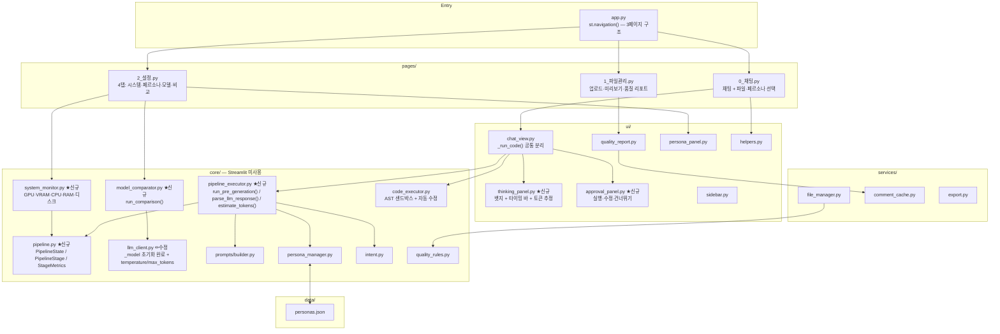
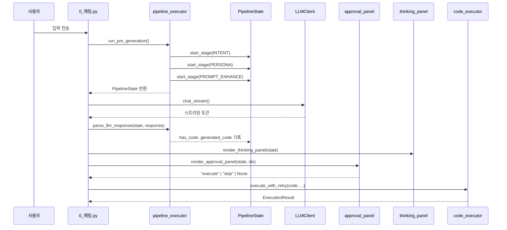

# Excel AI Platform — 코드 리뷰

작성일: 2026-05-22  
대상: main 브랜치 (약 3,400줄)  
이전 리뷰 대비 주요 변경: 파이프라인 레이어 신설, 시스템 모니터링 추가, 설정 페이지 4탭 통합, 페르소나 페이지 제거

---

## 1. 전체 아키텍처



**잘 지켜지는 것:** `core/`는 Streamlit을 import하지 않으며, `pipeline.py`·`pipeline_executor.py`·`system_monitor.py`·`model_comparator.py` 모두 이 원칙을 유지한다. `services/`는 외부 I/O만 담당한다.

---

## 2. 파이프라인 흐름

채팅 요청이 들어온 후 코드 실행까지 처리 흐름이 명확히 레이어화됐다.



---

## 3. 파일별 리뷰

### `core/pipeline.py` ✅ 신규 — 양호

`PipelineStage`(Enum), `StageMetrics`(dataclass), `PipelineState`(dataclass) 세 클래스로 파이프라인 상태를 표현한다.

- `start_stage()` → `StageMetrics.finish()` 패턴으로 각 단계 소요 시간이 자동 기록된다.
- `get_total_duration_ms()`, `get_stage_duration_ms()` 헬퍼로 thinking panel이 타이밍 바를 계산하기 편하다.
- `str, Enum` 다중 상속으로 stage 값을 문자열로 직접 비교할 수 있다.

**개선 여지:** `PipelineStage.CODE_GENERATED`가 `pipeline_executor.py`에서 사용되지 않는다. 실제로 사용하거나 제거해 enum 멤버를 정리한다.

---

### `core/pipeline_executor.py` ✅ 신규 — 양호

`run_pre_generation()`이 Intent → Persona → Prompt 보강 3단계를 순서대로 실행하면서 각 단계 메트릭을 `PipelineState`에 기록한다.

- 기존 `detect_intent`, `resolve_persona_key`, `augment_user_prompt`, `build_system_prompt`를 그대로 호출하므로 기존 로직 변경 없이 메트릭 수집만 추가됐다.
- `parse_llm_response()`가 정규식으로 코드 블록을 분리해 `state.has_code`, `state.generated_code`, `state.code_explanation`을 채운다.
- `estimate_tokens()`가 한국어 글자(×0.5)와 영문 단어(×1.3)를 구분하는 경량 추정이다. 정확도보다 속도 우선이라 실용적이다.

**개선 여지:** `parse_llm_response()`의 정규식이 첫 번째 코드 블록만 추출한다. 향후 다중 코드 블록이 필요한 경우 `code_blocks[0]` 대신 선택 로직이 필요하다.

---

### `core/system_monitor.py` ✅ 신규 — 양호

표준 라이브러리(`subprocess`, `urllib.request`)와 `psutil`만 사용해 외부 의존성이 최소화됐다.

- `get_gpu_status()` — `nvidia-smi` CSV 출력을 파싱. GPU 없거나 timeout 5초 초과 시 빈 리스트 반환으로 안전하다.
- `get_ollama_vram()` — `/api/ps` 엔드포인트로 현재 VRAM 점유 모델을 확인.
- `load_ollama_model()` / `unload_ollama_model()` — `keep_alive=-1` / `keep_alive=0` 으로 Ollama VRAM 제어.
- `get_system_status()` — `psutil.cpu_percent(interval=0.3)` 단기 샘플링. 0.3초 블로킹이 발생하지만 버튼 클릭 시만 호출되므로 허용 가능하다.

**개선 여지:**

```python
# get_gpu_status 내부 — 중첩 함수 _to_float 반복 정의
# 모듈 레벨 헬퍼로 분리 권장
def _to_float(s: str) -> float | None:
    try:
        return float(s)
    except ValueError:
        return None
```

`get_all_ollama_models()`와 `get_ollama_vram()`이 각각 `/api/tags`, `/api/ps`를 별도 호출한다. 시스템 모니터링 탭에서 두 함수를 연속으로 호출하면 HTTP 연결이 2번 발생한다. 단일 함수로 묶거나 호출부에서 캐싱을 고려한다.

---

### `core/model_comparator.py` ✅ 신규 — 양호

같은 프롬프트를 여러 `LLMClient` 인스턴스에 순차 실행하고 latency와 응답을 반환한다. 단순하고 명확하다.

**개선 여지:** 현재 순차 실행이라 3개 페르소나 비교 시 총 latency가 합산된다. 병렬 실행이 필요하면 `concurrent.futures.ThreadPoolExecutor`를 활용할 수 있다.

```python
# 현재 — 순차 실행
for cfg in configs:
    response = "".join(cfg["client"].chat_stream(...))

# 병렬 개선안
from concurrent.futures import ThreadPoolExecutor, as_completed

def _run_single(cfg, messages):
    t0 = time.time()
    response = "".join(cfg["client"].chat_stream(messages, cfg["system"]))
    return {"label": cfg["label"], "response": response, "latency_s": time.time() - t0, "error": None}

with ThreadPoolExecutor(max_workers=len(configs)) as ex:
    futures = {ex.submit(_run_single, cfg, messages): cfg for cfg in configs}
```

---

### `core/llm_client.py` ✅ 수정 완료

이전 리뷰에서 지적한 `OllamaClient._model` 미초기화 버그가 수정됐다.

```python
# 수정 후 — __init__에서 _model 초기화
def __init__(self, host: str = "http://localhost:11434", model: str = ""):
    import ollama
    self._client = ollama.Client(host=host)
    self._model = model          # ← 이전 리뷰에서 지적한 버그 수정
    self.temperature: float = 0.7
    self.num_predict: int = 4096
```

`get_client()` 팩토리 함수가 `temperature`와 `max_tokens`를 받아 각 클라이언트에 전달한다. 세 프로바이더(Ollama, Gemini, OpenAI)가 각자 다른 파라미터 이름(`num_predict`, `max_output_tokens`, `max_tokens`)을 사용하는데, 팩토리가 이 차이를 흡수한다.

**잔존 이슈:** `get_client()` 함수 마지막에 `return None`이 두 번 등장한다(하나는 `try` 블록 밖, 하나는 암묵적). `try/except` 후 `return None`을 한 번만 두는 방식으로 정리한다.

```python
# 현재 — return None 중복
def get_client(...):
    try:
        if provider == "Ollama":
            ...
            return c
        ...
    except Exception:
        return None   # ← except 블록의 return None
    return None       # ← try 블록 밖 불필요한 return None
```

---

### `core/prompts/builder.py` ✅ 양호

**잔존 이슈:** `augment_user_prompt`의 컬럼 언급 감지 최소 길이가 2다. "수", "명" 같은 단자 컬럼에서 false positive가 발생할 수 있다.

```python
# 현재 — 길이 2 이상: "수", "명" 같은 2글자 컬럼에서 false positive
mentioned = list(dict.fromkeys(col for col in all_cols if len(col) >= 2 and col in raw_prompt))

# 개선 — 길이 3 이상으로 강화
mentioned = list(dict.fromkeys(col for col in all_cols if len(col) >= 3 and col in raw_prompt))
```

---

### `core/persona_manager.py` ⚠️ 성능 주의

`_load()`가 매 호출마다 JSON 파일을 디스크에서 읽는다. `list_personas()`, `get_persona()`, `resolve_persona_key()`가 모두 `_load()`를 호출하고, 시스템 프롬프트 빌드 경로에서 요청마다 파일 I/O가 발생한다.

```python
# 현재 — 매 호출마다 파일 읽기
def _load() -> dict:
    if _PERSONA_FILE.exists():
        return json.loads(_PERSONA_FILE.read_text(encoding="utf-8"))
    return {"personas": {}, ...}

# 개선 — 파일 수정 시간 기반 무효화 캐시
_cache: dict | None = None
_cache_mtime: float = 0.0

def _load() -> dict:
    global _cache, _cache_mtime
    if not _PERSONA_FILE.exists():
        return {"personas": {}, "default_persona": "analyst", "intent_fallback": "analyst"}
    mtime = _PERSONA_FILE.stat().st_mtime
    if _cache is None or mtime != _cache_mtime:
        _cache = json.loads(_PERSONA_FILE.read_text(encoding="utf-8"))
        _cache_mtime = mtime
    return _cache
```

---

### `core/prompts/personas.py` ⚠️ 레거시 파일 잔존

`data/personas.json`으로 이관 완료됐으나 파일이 남아 있다. 실제로 import하는 곳이 없어 동작에는 영향이 없지만 혼란을 유발할 수 있다.

```python
# 삭제 대상 또는 아래 주석 추가
# DEPRECATED: 데이터는 data/personas.json으로 이관됨.
# 이 파일은 읽히지 않습니다. core/persona_manager.py 사용.
```

---

### `core/code_executor.py` ✅ 양호

- AST 기반 사전 검증으로 `exec` 전에 위험 코드를 차단한다.
- `_strip_preinjected_imports`로 LLM이 생성한 `import pandas`를 조용히 제거한다.
- `_Timeout` 컨텍스트 매니저로 30초 무한루프를 방지한다.

**주의:** `signal.SIGALRM`은 Linux/macOS 전용이다. Windows 이식 시 `threading.Timer` 기반으로 교체가 필요하다.

---

### `ui/thinking_panel.py` ✅ 신규 — 양호

`PipelineState`를 받아 Intent/Persona/Model 뱃지, 단계별 타이밍 바, 프롬프트 보강 비교, 시스템 프롬프트 전문, 토큰 추정을 하나의 `st.expander` 안에 렌더링한다.

- `_STAGE_LABELS` 딕셔너리로 enum → 한국어 라벨 변환이 깔끔하다.
- 타이밍 바가 `duration_ms / total_ms` 비율로 그려져 단계 간 상대 속도를 직관적으로 보여준다.

**개선 여지:** `total_ms == 0`일 때 `pct = 0`으로 처리되는데, 이 경우 모든 단계가 0%로 보여 사용자가 완료 여부를 착각할 수 있다. 완료되지 않은 단계는 `StageMetrics.ended_at`이 `None`인지 확인해 렌더링을 다르게 처리하는 것이 좋다.

---

### `ui/approval_panel.py` ✅ 신규 — 양호

[▶ 코드 실행] [✏️ 수정] [건너뛰기] 세 버튼과 수정 모드 text_area를 `msg_idx` 기반 session_state 키로 관리한다.

- 반환값이 `"execute"` / `"skip"` / `None` 세 가지로 명확해 호출부(chat_view)가 간결하다.
- 수정 모드에서 `state.generated_code`를 직접 업데이트한 후 `"execute"`를 반환하므로 `_run_code()`가 수정된 코드를 그대로 실행한다.
- "샌드박스 실행 · import/파일I/O 차단 · 30초 제한" 캡션이 실행 조건을 사용자에게 투명하게 안내한다.

---

### `ui/chat_view.py` ✅ 수정 — 개선됨

`_run_code()` 공통 함수로 코드 실행 로직이 단일 위치에 집중됐다. 이전에는 승인 버튼과 단일 실행 버튼이 각자 실행 로직을 갖고 있었다.

- `pipeline_states`가 있는 새 메시지는 `approval_panel`을 사용하고, 없는 과거 메시지는 단일 버튼 방식으로 폴백해 하위 호환성을 유지한다.
- `render_thinking_panel(state)`가 어시스턴트 메시지 뒤에 항상 렌더링된다.

---

### `pages/2_설정.py` ✅ 수정 — 대폭 확장

기존 단순 LLM 설정 단일 화면 → 4탭 구조로 확장됐다.

| 탭 | 내용 |
|----|------|
| 시스템 모니터링 | GPU 사용률·온도·전력, VRAM 점유 모델, 언로드/로드 제어, CPU·RAM·디스크 |
| 페르소나 관리 | 기존 `3_페르소나.py` 내용 통합 |
| 모델 관리 | 현재 모델 요약, temperature/max_tokens 슬라이더, 프롬프트 디버그 |
| 비교 테스트 | 동일 프롬프트를 여러 페르소나로 실행해 응답·latency 비교 |

페르소나 페이지 삭제로 `app.py`가 3페이지 구조로 단순화됐다.

---

### `services/file_manager.py` ⚠️ 중복 I/O

`get_file_info()`가 한 파일에 대해 3번 I/O를 수행한다. (이전 리뷰에서 지적, 미수정)

```python
def get_file_info(name):
    df = read_file(name)              # I/O 1 — pandas 로드
    wb = openpyxl.load_workbook(path) # I/O 2 — 시트 이름 읽기
    ur = get_used_range(path)         # I/O 3 — openpyxl 재로드 (내부)
```

`collect_files_info()`도 별도로 `read_file()`을 호출해 같은 파일을 따로 읽는다.

**개선:** `get_used_range`를 `get_file_info` 내부에서 같은 `openpyxl` 워크북 세션으로 계산해 I/O를 2회로 줄인다.

---

### `services/comment_cache.py` ✅ 양호

- profile dict 해시를 캐시 키로 사용해 파일 내용이 바뀌면 자동 무효화.
- `results/llm_comments_cache.json`에 영구 저장해 앱 재시작 후에도 LLM 재호출 없음.

**주의:** 단일 사용자 환경(로컬 앱)에서는 문제없지만, 동시 접속 환경에서 여러 사용자가 `save_comment()`를 동시에 호출하면 JSON 파일 경합이 발생할 수 있다.

---

### `ui/quality_report.py` ✅ 양호

**잔존 이슈:** `load_files_info`의 캐시 키가 파일명 tuple만 본다. 같은 파일명으로 다른 내용을 업로드해도 캐시가 유지된다.

```python
# 현재 — 파일명만 캐시 키
@st.cache_data(show_spinner=False)
def load_files_info(file_names: tuple) -> list[dict]:
    return collect_files_info(list(file_names))

# 개선 — 파일명 + 수정 시간을 키로
@st.cache_data(show_spinner=False)
def load_files_info(file_names: tuple, mtimes: tuple) -> list[dict]:
    return collect_files_info(list(file_names))

# 호출부에서 mtime tuple 계산 후 전달
mtimes = tuple((UPLOAD_DIR / n).stat().st_mtime for n in file_names if (UPLOAD_DIR / n).exists())
load_files_info(tuple(file_names), mtimes)
```

---

## 4. 캐시 전략 검토

```mermaid
flowchart LR
    Upload["파일 업로드"] -->|_clear_caches()| C1
    Delete["파일 삭제"] -->|_clear_caches()| C1

    C1["load_files_info\n@st.cache_data\n캐시 키: tuple(파일명) ⚠️ mtime 미포함"]
    C2["_cached_file_info\n@st.cache_data\n캐시 키: 파일명"]
    C3["comment_cache.json\n영구 JSON\n캐시 키: 파일명+profile해시"]

    C1 -->|미스| FM["collect_files_info()"]
    C2 -->|미스| FM2["get_file_info()"]
    FM --> QU["quality_rules.profile_quality()"]
    FM2 --> IO["I/O × 3회 ⚠️"]
```

**현재 문제:** `load_files_info` 캐시 키가 파일명만 포함 → 같은 이름으로 재업로드 시 캐시 미스 안 됨.

---

## 5. 우선순위별 개선 항목

### 즉시 수정 권장 (버그)

| # | 위치 | 문제 | 영향 |
|---|------|------|------|
| 1 | `core/llm_client.py:162` | `get_client()` 끝 불필요한 `return None` 중복 | 코드 품질, 정적 분석 경고 |
| 2 | `services/export.py:8` | `msg['content']` → 보강 프롬프트가 .md에 노출 | 내보내기 파일 품질 |

### 단기 개선 (코드 품질)

| # | 위치 | 문제 |
|---|------|------|
| 3 | `core/prompts/personas.py` | JSON 이관 완료 → 파일 삭제 또는 deprecation 주석 추가 |
| 4 | `core/prompts/builder.py` | `augment_user_prompt` 컬럼 감지 최소 길이 3으로 강화 |
| 5 | `ui/quality_report.py` | 캐시 키에 파일 수정 시간(mtime) 포함 |
| 6 | `core/pipeline.py` | 미사용 `PipelineStage.CODE_GENERATED` 제거 또는 실제 사용 |
| 7 | `core/system_monitor.py` | `_to_float` 중첩 함수를 모듈 레벨 헬퍼로 분리 |

### 중기 개선 (성능·아키텍처)

| # | 위치 | 문제 |
|---|------|------|
| 8 | `core/persona_manager.py` | `_load()` mtime 기반 모듈 레벨 캐시 추가 |
| 9 | `services/file_manager.py` | `get_file_info` 중복 I/O 통합 (3회 → 2회) |
| 10 | `core/model_comparator.py` | `ThreadPoolExecutor` 병렬 실행으로 비교 속도 개선 |
| 11 | `ui/thinking_panel.py` | 미완료 단계(`ended_at is None`) 별도 렌더링 처리 |
| 12 | `ui/persona_panel.py` | 편집 폼 `st.dialog` 모달화 |

### 장기 고려

| # | 문제 |
|---|------|
| 13 | `signal.SIGALRM` Linux 전용 → 멀티플랫폼 필요 시 `threading.Timer` 기반 타임아웃 |
| 14 | `comment_cache.py` 동시 쓰기 경합 → 다중 사용자 환경 필요 시 파일 락 추가 |
| 15 | `core/system_monitor.py` Ollama HTTP 호출 2회 → 단일 호출 또는 단기 캐싱 |

---

## 6. 이전 리뷰 대비 수정 현황

| # | 이슈 | 상태 |
|---|------|------|
| 1 | `OllamaClient._model` 미초기화 → `AttributeError` 위험 | ✅ 수정 완료 |
| 2 | `get_client()`에 temperature/max_tokens 파라미터 없음 | ✅ 수정 완료 |
| 3 | `3_페르소나.py` 별도 페이지 → 설정 탭 통합 | ✅ 완료 |
| 4 | `core/prompts/personas.py` 레거시 파일 잔존 | ⚠️ 미수정 |
| 5 | `augment_user_prompt` 컬럼 감지 최소 길이 2 | ⚠️ 미수정 |
| 6 | `load_files_info` 캐시 키에 mtime 미포함 | ⚠️ 미수정 |
| 7 | `persona_manager._load()` 매 호출마다 파일 읽기 | ⚠️ 미수정 |
| 8 | `file_manager.get_file_info()` 중복 I/O | ⚠️ 미수정 |

---

## 7. 잘 설계된 부분

- **파이프라인 레이어 분리** — `PipelineState`가 Intent → Persona → Prompt 보강 → LLM → 코드 실행까지 단계별 상태와 메트릭을 하나의 객체에 담는다. UI(thinking_panel)가 이를 읽어 렌더링만 담당해 관심사가 명확히 분리됐다.
- **LLM 프로바이더 추상화** — `OllamaClient`, `GeminiClient`, `OpenAIClient` 모두 동일한 `chat_stream` 인터페이스. 새 프로바이더 추가가 파일 하나 수정으로 끝난다.
- **approval_panel 반환 패턴** — `"execute"` / `"skip"` / `None` 세 값만 반환해 호출부가 간결하게 분기할 수 있다.
- **_run_code 공통 함수** — 승인 패널 경로와 레거시 단일 버튼 경로가 동일한 `_run_code()`를 호출해 코드 중복이 제거됐다.
- **시스템 모니터링 외부 의존성 최소화** — `system_monitor.py`가 표준 라이브러리만으로 Ollama API를 직접 호출해 별도 SDK 의존성이 없다.
- **페르소나 JSON 분리** — `data/personas.json`으로 데이터와 코드가 분리되어 코드 수정 없이 화면에서 페르소나를 관리할 수 있다.
- **품질 프로파일링 범용성** — `profile_quality()`가 컬럼 타입 기반으로 동작해 어떤 파일에도 적용 가능하며 파일별 하드코딩이 없다.
- **LLM 코멘트 캐시** — profile 해시 키로 파일 내용이 바뀌면 자동 무효화되고, 앱 재시작 후에도 유지된다.
- **AST 샌드박스** — `exec` 전에 코드를 트리로 파싱해 위험 모듈·함수를 차단하는 방식이 정교하다.
- **`last_result` 체이닝** — 이전 실행 결과가 다음 프롬프트와 executor 네임스페이스에 자동 주입되어 연속 작업이 자연스럽게 동작한다.
- **`pending_prompt` 패턴** — 후속 질문 버튼 클릭 → session_state → rerun → chat_input으로 이어지는 Streamlit 관용 패턴을 올바르게 사용하고 있다.
