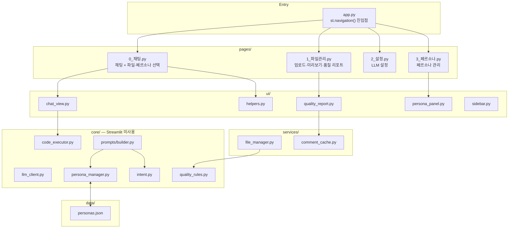

# Excel AI Platform — 코드 리뷰

작성일: 2026-05-22  
대상: main 브랜치 (약 2,600줄)

---

## 1. 전체 구조



**잘 지켜지는 것:** `core/`는 Streamlit을 import하지 않으며 `services/`는 외부 I/O만 담당한다. pages 분리로 각 화면의 책임이 명확해졌다.

---

## 2. 파일별 리뷰

### `core/llm_client.py` ✅ 양호

- ABC로 인터페이스가 명확히 정의되어 있어 새 프로바이더 추가가 쉽다.
- lazy import(`import ollama` 등을 `__init__` 내부에서)로 미설치 패키지가 있어도 앱이 기동된다.

**잔존 버그:** `OllamaClient._model`이 `__init__`에서 초기화되지 않는다. `with_model()` 호출 없이 `chat_stream()`을 부르면 `AttributeError`.

```python
# 현재
class OllamaClient(LLMClient):
    def __init__(self, host):
        self._client = ollama.Client(host=host)
        # self._model 없음

# 개선
def __init__(self, host, model: str = ""):
    self._client = ollama.Client(host=host)
    self._model = model
```

---

### `core/prompts/builder.py` ✅ 개선됨

- `_INTENT_TO_PERSONA` 하드코딩 제거 → `persona_manager.resolve_persona_key()` 위임으로 의존성이 줄었다.
- `persona_key` 파라미터 추가로 채팅에서 수동 페르소나 고정이 가능해졌다.

**잔존 이슈:**

`augment_user_prompt`의 컬럼 언급 감지가 짧은 컬럼명에 취약하다.

```python
# 현재 — "수", "명" 같은 단자 컬럼에 false positive
mentioned = [col for col in all_cols if len(col) >= 2 and col in raw_prompt]

# 개선 — 단어 경계 기반
mentioned = [col for col in all_cols if len(col) >= 3 and col in raw_prompt]
```

---

### `core/persona_manager.py` ⚠️ 성능 주의

- JSON 파일을 `_load()`가 호출마다 디스크에서 읽는다. 페르소나 조회가 자주 일어나는 `resolve_persona_key()` → `build_system_prompt()` 경로에서 매 요청마다 파일 I/O가 발생한다.

```python
# 현재 — 매 호출마다 파일 읽기
def _load() -> dict:
    return json.loads(_PERSONA_FILE.read_text(...))

# 개선 — 모듈 레벨 캐시 + 파일 수정 시간 무효화
_cache: dict | None = None
_cache_mtime: float = 0.0

def _load() -> dict:
    global _cache, _cache_mtime
    mtime = _PERSONA_FILE.stat().st_mtime
    if _cache is None or mtime != _cache_mtime:
        _cache = json.loads(_PERSONA_FILE.read_text(...))
        _cache_mtime = mtime
    return _cache
```

---

### `core/quality_rules.py` ✅ 양호

- 컬럼 타입 기반 범용 프로파일링으로 파일별 하드코딩이 없다.
- IQR×3 기준 이상값, 소계/합계 패턴 감지, 타입 혼재(30~70% 수치) 분류가 실용적이다.

**개선 여지:** `_SUMMARY_RE`의 `^계$` 패턴이 `re.MULTILINE` 없이도 전체 셀 값에 `^/$`를 적용하려면 `\b계\b` 또는 `(?:^|\\s)계(?:$|\\s)`로 수정하는 것이 더 정확하다.

---

### `core/code_executor.py` ✅ 양호

- AST 기반 사전 검증으로 `exec` 전에 위험 코드를 차단한다.
- `_strip_preinjected_imports`로 `import pandas`를 조용히 제거해 불필요한 오류 노출 방지.
- `_Timeout` 컨텍스트 매니저로 30초 무한루프 방지.

**주의:** `signal.SIGALRM`은 Linux/macOS 전용. Windows 이식 시 `threading.Timer` 기반으로 교체 필요.

---

### `services/file_manager.py` ⚠️ 중복 I/O

`get_file_info()`가 한 파일에 대해 **3번** I/O를 수행한다.

```python
def get_file_info(name):
    df = read_file(name)              # I/O 1 — pandas 로드
    wb = openpyxl.load_workbook(path) # I/O 2 — 시트 이름 읽기
    ur = get_used_range(path)         # I/O 3 — openpyxl 재로드 (내부)
```

`collect_files_info()`도 별도로 `read_file()`을 호출해 두 함수가 같은 파일을 따로 읽는다.

**개선:** `get_used_range`를 `get_file_info` 안에서 같은 `openpyxl` 워크북 세션으로 계산.

---

### `services/comment_cache.py` ✅ 양호

- profile dict 해시를 캐시 키로 사용해 파일 내용이 바뀌면 자동 무효화.
- `results/llm_comments_cache.json`에 영구 저장해 앱 재시작 후에도 LLM 재호출 없음.

**주의:** 동시 접속 환경에서 여러 사용자가 동시에 `save_comment()`를 호출하면 JSON 파일 경합이 발생할 수 있다. 단일 사용자 환경(로컬 앱)에서는 문제없음.

---

### `ui/quality_report.py` ✅ 대폭 개선

- 기존 "특이사항 없음" 고정 텍스트 → `bullets_from_profile()` 기반 실제 진단 결과 표시.
- AI 코멘트 버튼 → 생성 후 캐시 → 이후 즉시 표시 구조가 깔끔하다.

**주의:** `load_files_info`의 캐시 키가 파일명 tuple만 본다. 같은 파일명으로 다른 내용을 업로드해도 캐시가 유지된다.

```python
# 개선 — 파일명 + 수정 시간을 키로
@st.cache_data(show_spinner=False)
def load_files_info(file_names: tuple, mtimes: tuple) -> list[dict]:
    return collect_files_info(list(file_names))
```

---

### `ui/persona_panel.py` ✅ 양호

- `st.form`으로 불필요한 rerun을 방지했다.
- 프리셋/커스텀 분리 표시, 삭제 권한 분리가 명확하다.

**개선 여지:** 편집 폼이 카드 바로 아래 인라인으로 열리는데, 여러 카드를 동시에 열면 UI가 길어진다. `st.dialog`로 모달화하면 더 깔끔하다.

---

### `core/prompts/personas.py` ⚠️ 레거시

`data/personas.json`으로 이관 완료됐으나 파일이 남아 있다. 혼란을 막기 위해 삭제하거나 deprecation 주석을 추가한다.

```python
# 삭제 대상 — 데이터는 data/personas.json으로 이관됨
# core/persona_manager.py 사용
```

---

## 3. 캐시 전략 검토

```mermaid
flowchart LR
    Upload["파일 업로드"] -->|_clear_caches()| C1
    Delete["파일 삭제"] -->|_clear_caches()| C1

    C1["load_files_info\n@st.cache_data\n캐시 키: tuple(파일명)"]
    C2["_cached_file_info\n@st.cache_data\n캐시 키: 파일명"]
    C3["comment_cache.json\n영구 JSON\n캐시 키: 파일명+profile해시"]

    C1 -->|미스| FM["collect_files_info()"]
    C2 -->|미스| FM2["get_file_info()"]
    FM --> QU["quality_rules.profile_quality()"]
```

**현재 문제:** `load_files_info` 캐시 키가 파일명만 포함 → 같은 이름으로 재업로드 시 캐시 미스 안 됨.

**개선안:**
```python
@st.cache_data(show_spinner=False)
def load_files_info(file_names: tuple) -> list[dict]:
    mtimes = tuple(
        (UPLOAD_DIR / n).stat().st_mtime
        for n in file_names if (UPLOAD_DIR / n).exists()
    )
    return _load_impl(file_names, mtimes)

@st.cache_data(show_spinner=False)
def _load_impl(file_names: tuple, mtimes: tuple) -> list[dict]:
    return collect_files_info(list(file_names))
```

---

## 4. 우선순위별 개선 항목

### 즉시 수정 권장 (버그)

| # | 위치 | 문제 | 영향 |
|---|------|------|------|
| 1 | `core/llm_client.py` | `OllamaClient._model` 미초기화 | `AttributeError` 위험 |
| 2 | `services/export.py:8` | `msg['content']` → 보강 프롬프트가 .md에 노출 | 내보내기 파일 품질 |

### 단기 개선 (코드 품질)

| # | 위치 | 문제 |
|---|------|------|
| 3 | `core/prompts/personas.py` | JSON 이관 완료 → 파일 삭제 또는 deprecation 표시 |
| 4 | `core/quality_rules.py` | `^계$` 패턴을 `\b계\b`로 수정 |
| 5 | `ui/quality_report.py` | 캐시 키에 파일 수정 시간 포함 |
| 6 | `core/prompts/builder.py` | `augment_user_prompt` 컬럼 감지 최소 길이 3으로 강화 |

### 중기 개선 (성능·아키텍처)

| # | 위치 | 문제 |
|---|------|------|
| 7 | `core/persona_manager.py` | `_load()` 모듈 레벨 캐시 추가 |
| 8 | `services/file_manager.py` | `get_file_info` 중복 I/O 통합 |
| 9 | `ui/persona_panel.py` | 편집 폼 `st.dialog` 모달화 |

### 장기 고려

| # | 문제 |
|---|------|
| 10 | `signal.SIGALRM` Linux 전용 → 멀티플랫폼 필요 시 threading 기반 타임아웃 |
| 11 | `comment_cache.py` 동시 쓰기 경합 → 다중 사용자 환경 필요 시 파일 락 추가 |

---

## 5. 잘 설계된 부분

- **LLM 프로바이더 추상화** — `OllamaClient`, `GeminiClient`, `OpenAIClient` 모두 동일한 `chat_stream` 인터페이스. 새 프로바이더 추가가 파일 하나 수정으로 끝난다.
- **페르소나 JSON 분리** — `data/personas.json`으로 데이터와 코드가 분리되어 코드 수정 없이 화면에서 페르소나를 관리할 수 있다.
- **품질 프로파일링 범용성** — `profile_quality()`가 컬럼 타입 기반으로 동작해 어떤 파일에도 적용 가능하며 파일별 하드코딩이 없다.
- **LLM 코멘트 캐시** — profile 해시 키로 파일 내용이 바뀌면 자동 무효화되고, 앱 재시작 후에도 유지된다.
- **AST 샌드박스** — `exec` 전에 코드를 트리로 파싱해 위험 모듈·함수를 차단하는 방식이 정교하다.
- **`last_result` 체이닝** — 이전 실행 결과가 다음 프롬프트와 executor 네임스페이스에 자동 주입되어 "그중에서 서울만" 같은 연속 작업이 자연스럽게 동작한다.
- **`pending_prompt` 패턴** — 후속 질문 버튼 클릭 → session_state → rerun → chat_input으로 이어지는 Streamlit 관용 패턴을 올바르게 사용하고 있다.
- **`_strip_preinjected_imports`** — LLM이 `import pandas`를 생성해도 조용히 제거해 불필요한 검증 오류를 사용자에게 노출하지 않는다.
