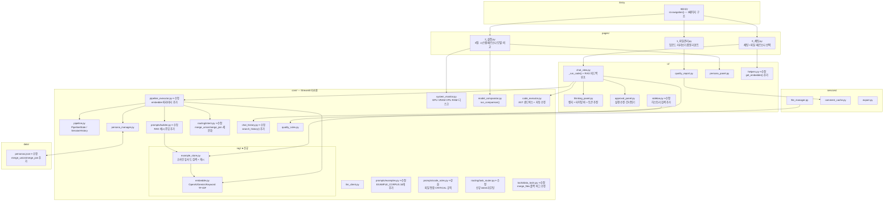
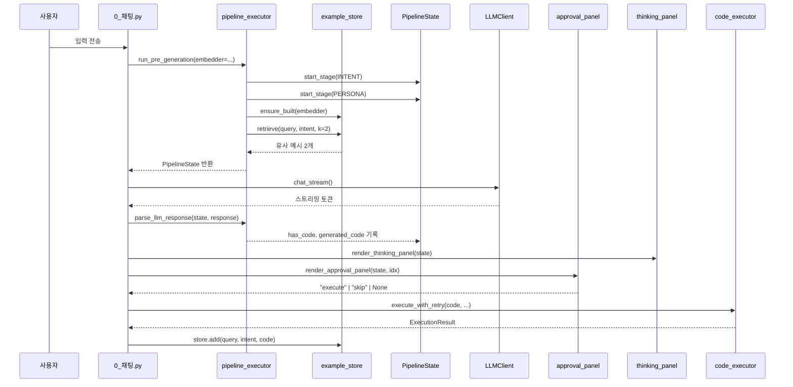

# Excel AI Platform — 코드 리뷰

작성일: 2026-05-22  
최종 수정: 2026-05-27  
대상: main 브랜치 (약 5,400줄)  
이번 리뷰 추가 범위: merge 라우팅 버그 수정, examples.py 플레이스홀더 정비, 소계 행 분리, 프롬프트 품질 개선

---

## 1. 전체 아키텍처



**잘 지켜지는 것:** `core/`는 Streamlit을 import하지 않는다. `rag/`도 이 원칙을 유지한다 — embedder와 example_store 모두 순수 Python이다.

---

## 2. 파이프라인 흐름



---

## 3. 파일별 리뷰

### `core/rag/embedder.py` ✅ 신규 — 양호

`Embedder` 추상 클래스 + 3종 구현체로 임베더 교체가 인터페이스 변경 없이 가능하다.

- `OpenAIEmbedder` — `text-embedding-3-small`, 배치 API 호출 (한 번에 여러 텍스트).
- `GeminiEmbedder` — `models/text-embedding-004`, 텍스트별 개별 호출.
- `KeywordEmbedder` — API 키 없을 때 자동 폴백. 한국어 문자 bigram TF-IDF를 numpy만으로 구현. `fit()` → `embed()` 순서를 명확히 분리.

**잘 설계된 점:**
- `embedder.name` 프로퍼티로 임베더 종류를 식별 → `example_store`가 임베더 변경 시 캐시를 자동 재빌드.
- 각 임베더가 L2 정규화된 벡터를 반환하므로 `example_store`에서 dot product만으로 코사인 유사도 계산 가능.

**개선 여지:**
- `GeminiEmbedder.embed()`가 텍스트마다 개별 API를 호출한다. `EmbedContentRequest` 배치 API로 전환하면 대규모 코퍼스 빌드 시 속도가 개선된다.
- `KeywordEmbedder.fit()`이 `embed()` 전에 반드시 호출돼야 하는데, 이 강제 순서가 추상 인터페이스에 드러나지 않는다. `__init__` 내부에서 빈 코퍼스로 auto-fit하거나 `embed()` 내에서 미빌드 감지를 추가하면 안전하다.

---

### `core/rag/example_store.py` ✅ 신규 — 양호

모듈 레벨 싱글톤(`get_store()`)으로 앱 전체에서 하나의 스토어를 공유한다.

- `ensure_built(embedder)` — 임베더 이름이 바뀌면 자동으로 전체 재빌드. Streamlit 세션이 바뀌어도 캐시 파일(`.rag/embedding_cache.json`)이 살아 있으면 즉시 로드.
- `retrieve(query, intent, k)` — 코사인 유사도 + 동일 intent이면 +0.1 보너스. compact 모드(소형 모델)에서는 k=1.
- `add(query, intent, code, files_info)` — 성공 코드의 파일명을 `{FILE_A}` 플레이스홀더로 정규화 후 `custom_examples.json`에 저장. 추가 후 전체 vocab 재빌드.
- `_normalize_code()` — 파일명만 치환하고 컬럼명은 그대로 유지 → LLM이 시스템 프롬프트의 파일 컨텍스트에서 컬럼명을 이미 알고 있기 때문에 올바른 결정.

**개선 여지:**
- `add()` 호출 시마다 `KeywordEmbedder`는 전체 vocab을 재빌드한다. 커스텀 예시가 많아지면 누적 비용이 증가한다. 배치 추가(`add_many`) 또는 업데이트를 일정 개수 모은 후 한 번에 재빌드하는 방식으로 개선 가능.
- 커스텀 예시의 중복 방지 로직이 없다. 동일 질문으로 여러 번 성공하면 같은 내용의 예시가 중복 저장된다. `query` 또는 코드 해시로 중복 체크를 추가하면 좋다.

---

### `core/routing/intent.py` ✅ 개선 — 양호

`merge` 단일 의도 → `merge_union` / `merge_join` / `merge` 3분기로 세분화됐다.

- `_MERGE_UNION_HINTS` — 월별 키워드(1월~12월), 분기, 세로로, 같은 구조 등 32개.
- `_MERGE_JOIN_HINTS` — 조인, 사번, 고객id, 키 기준 등 12개.
- `detect_merge_subtype(prompt)` — 두 힌트 집합의 점수를 비교해 서브타입 반환.
- `detect_intent()`가 merge 키워드 점수에 힌트 점수도 누적 → "조인"처럼 `_INTENT_MAP["merge"]`에 없는 한국어 키워드도 merge로 감지.

**잘 설계된 점:** 서브타입 힌트가 `_INTENT_MAP`과 독립된 집합으로 관리되어 `_INTENT_MAP` 수정 없이 세분화 규칙만 별도로 튜닝할 수 있다.

**개선 여지:** `_MERGE_UNION_HINTS`의 월 키워드("1월"~"12월")가 집계 요청("3월 매출 평균 구해줘")에서도 감지될 수 있다. 집계 점수가 더 높을 때는 aggregate가 이기므로 실제 충돌은 드물지만, 월 키워드를 단독 감지보다 다른 힌트와 AND 조건으로 사용하는 방식을 고려해 볼 수 있다.

---

### `core/routing/task_router.py` ✅ 버그 수정 — 양호

`_intent_defaults`에 `merge_union: ("tool", 0.80)`, `merge_join: ("code", 0.75)` 추가됐다.

- `merge_union` — confidence 0.80으로 바로 `merge_same_format` 도구 실행. 구조가 확실한 요청이라 LLM 불필요.
- `merge_join` — `code` 모드로 LLM이 키 컬럼을 분석하고 `pd.merge` 코드를 생성. confidence 0.75로 LLM 분류 단계를 거친다.

**이번 수정 — 라우팅 버그 수정:**
`intent.py`가 `merge_union`/`merge_join`을 정확히 감지해도 `_rule_classify()`의 키워드 루프가 먼저 실행되어 `merge_files`로 잘못 라우팅되는 버그가 있었다. "합쳐줘" 같은 키워드가 merge 분기로 잡히면 intent 결과를 덮어쓰는 구조였다.

수정: `_rule_classify()` 최상단에 intent 선행 체크 추가.

```python
def _rule_classify(prompt: str, intent: str) -> dict:
    options = _detect_options(prompt)
    # ── intent 선행 라우팅 — 키워드 루프보다 먼저 처리 ──
    if intent == "merge_union":
        return {"mode": "tool", "tool": "merge_same_format", "confidence": 0.88, **options}
    if intent == "merge_join":
        return {"mode": "code", "tool": None, "confidence": 0.80, **options}
    # ... 이하 키워드 루프
```

**효과:** `intent.py`의 서브타입 감지 결과가 이제 실제로 라우팅에 반영된다.

---

### `core/tools/data_tools.py` ✅ 수정 — 버그 수정

**merge_files() 수정:**
공통 컬럼 없을 때 `pd.concat` 무단 실행 버그가 수정됐다.

```python
# 수정 전 — 공통 컬럼 없으면 concat으로 조용히 처리 (데이터 오염)
else:
    result = pd.concat([df_left, df_right], ignore_index=True)

# 수정 후 — 명확한 오류 메시지 + 수직 통합 요청 안내
if not common:
    return {
        "type": "error",
        "message": (
            "두 파일에 공통 컬럼이 없어 수평 결합(join)을 할 수 없습니다.\n"
            "수직 통합(concat)이 필요하다면 '세로로 합쳐줘'처럼 요청하거나, "
            "join 기준이 될 공통 키 컬럼을 알려 주세요."
        ),
    }
```

공통 키 선택 기준도 `common[0]` (임의 첫 번째) → `max(non_numeric, key=nunique/len)` (숫자 컬럼 제외 후 unique 비율 최대 컬럼)으로 개선됐다. 예산 금액처럼 숫자가 우연히 겹치는 컬럼이 key로 선택되는 오류가 방지된다.

**merge_same_format() 수정 — 소계 행 버그:**
예실대비표처럼 행 중간에 `소 계`, `합계` 같은 소계 행이 포함된 파일을 3개 통합할 때, 모든 소계 행의 key가 `(소 계, NaN, NaN)`으로 동일해 groupby에서 하나로 합쳐지는 버그가 있었다.

수정: groupby 전에 소계 행을 분리하고, 집계 후 맨 뒤에 중복 제거 후 재부착.

```python
_SUBTOTAL_PATTERNS = {"소 계", "소계", "합 계", "합계", "계", "총계", "총 계", "내부흡수액"}
_first_text_col = next(
    (c for c in common_cols if not pd.api.types.is_numeric_dtype(combined[c])), None
)
if _first_text_col:
    _is_subtotal = combined[_first_text_col].astype(str).str.strip().isin(_SUBTOTAL_PATTERNS)
    subtotal_rows = combined[_is_subtotal].copy()
    combined = combined[~_is_subtotal].reset_index(drop=True)
```

**효과:** 각 예산 항목(인건비, 재료비 등)의 소계가 독립적으로 보존되어 올바른 결과가 생성된다.

---

### `core/prompts/examples.py` ✅ 버그 수정 + 확장 — 양호

기존 `EXAMPLES` dict(정적 fallback) 위에 `EXAMPLE_CORPUS`(18개 RAG 검색 대상)가 추가됐다.

| intent | 예시 수 |
|--------|---------|
| filter | 3 (numeric / string / isin) |
| aggregate | 3 (groupby sum / agg / pivot) |
| transform | 2 (fillna+astype / new column) |
| merge_join | 1 (n파일 reduce merge) |
| merge_union | 1 (concat 세로 통합) |
| analyze | 5 (basic / missing / numeric / correlation / time_series) |
| export | 2 (dataframe / filtered export) |
| query | 1 (column list) |

**이번 수정 — 플레이스홀더 버그 수정:**
예시 코드에 포함된 한국어 플레이스홀더가 실행 시 NameError를 일으키거나 LLM이 그대로 복사해 환각을 유발했다. `EXAMPLE_CORPUS`와 정적 `EXAMPLES` dict 양쪽 모두 수정됐다.

| 수정 전 | 수정 후 | 이유 |
|---------|---------|------|
| `df[df["컬럼명"] >= 기준값]` | `기준값 = 0  # 실제 기준값으로 교체` | NameError 방지 |
| `df[df["컬럼명"] >= 값]` | `기준값 = 0  # 실제 기준값으로 교체` | NameError 방지 |
| `from functools import reduce` | 제거 | namespace에 이미 주입됨 |
| `save("merged.xlsx")` | 제거 | 자동 저장 중복 호출 방지 |
| `ax.set_xlabel("기준컬럼")` | `select_dtypes` 동적 감지 | 다른 파일에서 환각 방지 |

**차트 템플릿 — 동적 컬럼 감지:**
하드코딩된 `"기준컬럼"`, `"숫자컬럼"`, `"날짜컬럼"` 대신 `select_dtypes`로 실제 컬럼을 런타임에 선택한다.

```python
cat_cols = df.select_dtypes(exclude="number").columns.tolist()
num_cols = df.select_dtypes(include="number").columns.tolist()
cat_col = cat_cols[0] if cat_cols else df.columns[0]
num_col = num_cols[0] if num_cols else df.columns[-1]
df.groupby(cat_col)[num_col].sum().plot(kind="bar", ax=ax, color="steelblue")
ax.set_title(f"{cat_col}별 {num_col} 합계")
```

`merge_join_key`, `merge_concat_vertical`의 intent가 `"merge"` → `"merge_join"` / `"merge_union"`으로 수정되어 RAG 검색 시 intent bonus가 정확히 적용된다.

---

### `core/prompts/code_rules.py` ✅ 강화 — 양호

파일 통합 규칙이 단순 가이드 → 3단계 CRITICAL 규칙으로 대폭 강화됐다.

**핵심 변경:**
- **Step 1** — 통합 전 공통 컬럼 overlap_ratio 계산 코드 예시 포함.
- **Step 2** — `pd.concat` 허용 조건: overlap_ratio ≥ 80% **AND** 기간/지역/부서로 분할된 데이터.
- **Step 3** — `pd.merge` 조건: 공통 키 컬럼 반드시 먼저 탐색. 키 불명확 시 `print(후보)` 후 중단.
- **⛔ 절대 금지** — 구조 다른 파일에 `pd.concat` 사용, 키 모르는 상태로 `pd.merge`, 구조 파악 없이 바로 통합.

**이번 수정 — 도메인 특정 표현 제거:**
Step 3 예시에 "매출 + 직원 정보", "사번·고객ID·상품코드" 같은 도메인 특정 언어가 있었다. 이런 예시는 다른 업종 파일이 입력될 때 LLM이 존재하지 않는 컬럼명을 그대로 사용하는 환각을 유발한다.

수정: "서로 다른 성격의 데이터", "고유 식별자 컬럼(ID류·코드류·날짜류)"처럼 추상적 표현으로 교체했다. 키 후보 선택 코드도 숫자 컬럼을 자동 제외하는 로직으로 강화됐다.

```python
non_numeric = [c for c in common_cols if not pd.api.types.is_numeric_dtype(dfs[0][c])]
candidates = non_numeric if non_numeric else common_cols
key_col = max(candidates, key=lambda c: dfs[0][c].nunique() / max(len(dfs[0]), 1))
```

---

### `core/execution/code_executor.py` ✅ 수정 — 개선

`execute_with_retry()`의 자동 수정 프롬프트에 KeyError 특화 힌트가 추가됐다.

```python
_keyerror_hint = ""
_ke_match = re.search(r"KeyError:\s*['\"]?([^'\"\n]+)['\"]?", result.error)
if _ke_match:
    _keyerror_hint = (
        f"\n[참고] 존재하지 않는 컬럼 '{_ke_match.group(1).strip()}'을 사용했습니다. "
        f"아래 실제 컬럼명 목록에서 올바른 이름을 찾아 수정하세요.\n"
    )
```

수정 프롬프트에 이미 실제 파일 컬럼 스키마(`_build_file_schema`)가 포함돼 있어 LLM이 올바른 컬럼명을 찾아 수정하는 데 유리하다.

**잘 설계된 점:** 타임아웃·보안 위반 오류는 재시도해도 해결이 불가능하므로 `_no_retry_signals` 체크로 즉시 반환한다. 불필요한 LLM 호출을 차단한다.

---

### `core/chat_history.py` ✅ 확장 — 양호

`search_history(query, max_results)` 함수가 추가됐다.

- `.chat_history/*.json`에서 user 메시지를 순회하며 키워드 매칭.
- python 코드 블록이 뒤따르는 assistant 메시지와 연결 → 실제 실행된 분석 코드만 반환.
- 결과를 쿼리-코드 쌍으로 반환하고 중복 제거 후 최대 `max_results`개 반환.

**개선 여지:** 현재 키워드 단순 매칭(split + contains)이라 형태소 분석 없이 부분 일치만 지원한다. `KeywordEmbedder`를 재활용해 임베딩 기반 검색으로 전환하면 "3월 매출"로 "월별 매출 분석" 같은 결과도 찾을 수 있다.

---

### `ui/sidebar.py` ✅ 확장 — 양호

`🔍 분석 히스토리 검색` expander가 추가됐다.

- 키워드 입력 → `search_history()` 호출 → 날짜·쿼리 미리보기·코드 expander 표시.
- `↩ 사용` 버튼 클릭 → `st.session_state.pending_prompt = query` → `st.switch_page("pages/0_채팅.py")` — Streamlit의 관용 패턴을 올바르게 사용.

---

### `ui/helpers.py` ✅ 확장 — 양호

`get_embedder()` 함수가 추가됐다.

- OpenAI 키 있으면 `OpenAIEmbedder`, Gemini 키 있으면 `GeminiEmbedder`, 없으면 `KeywordEmbedder` 자동 폴백.
- 호출부(`pages/0_채팅.py`, `pipeline_executor`)에서 임베더 선택 로직이 완전히 분리됐다.

**이번 수정:** 기본 Ollama 모델이 `None` → `"gemma3:27b"`로 변경됐다. 앱 최초 실행 시 모델 미선택 상태로 오류가 나는 경험이 개선됐다.

---

### `ui/chat_view.py` ✅ 확장 — 양호

`_run_code()` 성공 후 RAG 피드백 루프가 추가됐다.

```python
if result.success and original_question and code:
    try:
        from core.rag.example_store import get_store
        ...
        get_store().add(original_question, _intent, code, _fi)
    except Exception:
        pass  # 피드백 실패가 사용자 경험에 영향을 주지 않도록 조용히 처리
```

**잘 설계된 점:** `try/except: pass` 패턴으로 RAG 저장 실패가 코드 실행 결과 렌더링에 전혀 영향을 주지 않는다.

---

### `core/pipeline.py` ✅ 기존 — 양호

**잔존 이슈:** `PipelineStage.CODE_GENERATED`가 사용되지 않는다. (이전 리뷰에서 지적, 미수정)

---

### `core/pipeline_executor.py` ✅ 수정 — 개선

`embedder` 파라미터가 추가되어 `run_pre_generation()` 내부에서 `get_store().ensure_built(embedder)`를 호출한다. `build_system_prompt()`에 `user_query` 파라미터가 전달되어 RAG 예시 주입이 이뤄진다.

**개선됨:** 이전 리뷰에서 지적한 `augment_user_prompt` 단계(Prompt 보강)가 제거됐다. 시퀀스가 Intent → Persona → System Prompt 빌드로 단순화됐다.

---

### `core/prompts/builder.py` ✅ 수정 — 개선

RAG 예시 주입 함수(`_build_rag_example`, `_resolve_placeholders`)가 추가됐다.

**폴백 체인:**
1. RAG store가 ready이면 `store.retrieve()` → 유사 예시 주입
2. RAG store 미준비 또는 결과 없음 → 정적 `EXAMPLES` dict 사용
3. 항상 코드 예시가 포함되도록 보장

**이번 수정:**
- head_sample 크기를 1행/5컬럼 → 3행/8컬럼으로 확대. 병합 키 후보를 LLM이 실제 데이터 값을 보고 판단할 수 있다.
- code 모드 프롬프트에 실제 컬럼명 참조 섹션 추가. 플레이스홀더 컬럼명 사용을 차단한다.

```python
col_ref_lines = []
for f in files_info:
    cols = ", ".join(f'"{c}"' for c in f["col_names"])
    col_ref_lines.append(f"  {f['name']}: [{cols}]")
if col_ref_lines:
    parts.append(
        "## 코드에서 사용 가능한 실제 컬럼명\n"
        + "\n".join(col_ref_lines)
        + "\n위 컬럼명 외의 이름은 파일에 존재하지 않습니다."
    )
```

**잔존 이슈:** `augment_user_prompt`의 컬럼 감지 최소 길이 2 → 이 함수는 이제 pipeline에서 호출되지 않으므로 사실상 dead code. 삭제 대상.

---

### `core/system_monitor.py` ✅ 기존 — 양호

**잔존 이슈:** `_to_float` 중첩 함수 반복 정의, Ollama HTTP 호출 2회 비효율. (이전 리뷰 지적, 미수정)

---

### `core/persona_manager.py` ⚠️ 성능 주의

`_load()` 매 호출마다 파일 읽기. (이전 리뷰 지적, 미수정)

---

### `services/file_manager.py` ⚠️ 중복 I/O

`get_file_info()` 한 파일에 3번 I/O. (이전 리뷰 지적, 미수정)

---

### `ui/quality_report.py` ⚠️ 캐시 키 부정확

`load_files_info` 캐시 키에 mtime 미포함. (이전 리뷰 지적, 미수정)

---

## 4. 캐시 전략 검토

```mermaid
flowchart LR
    Upload["파일 업로드"] -->|_clear_caches()| C1
    Delete["파일 삭제"] -->|_clear_caches()| C1

    C1["load_files_info\n@st.cache_data\n캐시 키: tuple(파일명) ⚠️ mtime 미포함"]
    C2["_cached_file_info\n@st.cache_data\n캐시 키: 파일명"]
    C3["comment_cache.json\n영구 JSON\n캐시 키: 파일명+profile해시"]
    C4[".rag/embedding_cache.json\n영구 JSON\n캐시 키: embedder.name ✅"]

    C1 -->|미스| FM["collect_files_info()"]
    C2 -->|미스| FM2["get_file_info()"]
    FM --> QU["quality_rules.profile_quality()"]
    FM2 --> IO["I/O × 3회 ⚠️"]
    C4 -->|embedder 변경| REBUILD["전체 재빌드"]
```

**신규 캐시:** `.rag/embedding_cache.json`은 `embedder.name`을 키로 사용해 임베더 전환 시 자동 무효화. 올바른 설계.

---

## 5. 우선순위별 개선 항목

### 즉시 수정 권장 (버그·UX)

| # | 위치 | 문제 | 영향 |
|---|------|------|------|
| 1 | `core/llm_client.py` | `get_client()` 끝 불필요한 `return None` 중복 | 정적 분석 경고 |
| 2 | `services/export.py` | `msg['content']` → 보강 프롬프트가 .md에 노출 | 내보내기 파일 품질 |

### 단기 개선 (코드 품질)

| # | 위치 | 문제 |
|---|------|------|
| 3 | `core/prompts/builder.py` | `augment_user_prompt` — pipeline에서 미사용 → dead code 삭제 |
| 4 | `core/pipeline.py` | 미사용 `PipelineStage.CODE_GENERATED` 제거 |
| 5 | `ui/quality_report.py` | 캐시 키에 파일 수정 시간(mtime) 포함 |
| 6 | `core/system_monitor.py` | `_to_float` 중첩 함수를 모듈 레벨 헬퍼로 분리 |
| 7 | `core/rag/example_store.py` | 커스텀 예시 중복 저장 방지 (query 또는 코드 해시 체크) |
| 8 | `core/rag/embedder.py` | `KeywordEmbedder` — `embed()` 내 미빌드 자동 감지 |

### 중기 개선 (성능·아키텍처)

| # | 위치 | 문제 |
|---|------|------|
| 9 | `core/persona_manager.py` | `_load()` mtime 기반 모듈 레벨 캐시 추가 |
| 10 | `services/file_manager.py` | `get_file_info` 중복 I/O 통합 (3회 → 2회) |
| 11 | `core/model_comparator.py` | `ThreadPoolExecutor` 병렬 실행으로 비교 속도 개선 |
| 12 | `ui/thinking_panel.py` | 미완료 단계(`ended_at is None`) 별도 렌더링 처리 |
| 13 | `core/rag/embedder.py` | `GeminiEmbedder` — 배치 API 전환으로 코퍼스 빌드 속도 개선 |
| 14 | `core/rag/example_store.py` | `add()` 누적 시 KeywordEmbedder 전체 재빌드 비용 → 배치 지연 빌드 |
| 15 | `core/chat_history.py` | `search_history` — 키워드 매칭 → KeywordEmbedder 임베딩 기반 검색 |

### 장기 고려

| # | 문제 |
|---|------|
| 16 | `signal.SIGALRM` Linux 전용 → 멀티플랫폼 필요 시 `threading.Timer` 기반 타임아웃 |
| 17 | `comment_cache.py` 동시 쓰기 경합 → 다중 사용자 환경 필요 시 파일 락 추가 |
| 18 | `core/system_monitor.py` Ollama HTTP 호출 2회 → 단일 호출 또는 단기 캐싱 |
| 19 | `core/routing/intent.py` 월 키워드 — 집계 요청과 충돌 가능 → AND 조건으로 보강 |

---

## 6. 이전 리뷰 대비 수정 현황

| # | 이슈 | 상태 |
|---|------|------|
| 1 | `OllamaClient._model` 미초기화 → `AttributeError` 위험 | ✅ 수정 완료 |
| 2 | `get_client()`에 temperature/max_tokens 파라미터 없음 | ✅ 수정 완료 |
| 3 | `3_페르소나.py` 별도 페이지 → 설정 탭 통합 | ✅ 완료 |
| 4 | `augment_user_prompt` 단계 제거 (파이프라인 단순화) | ✅ 완료 |
| 5 | `core/prompts/personas.py` 레거시 파일 잔존 | ⚠️ 미수정 |
| 6 | `augment_user_prompt` 컬럼 감지 최소 길이 2 → dead code로 전락 | ⚠️ 함수 삭제 필요 |
| 7 | `load_files_info` 캐시 키에 mtime 미포함 | ⚠️ 미수정 |
| 8 | `persona_manager._load()` 매 호출마다 파일 읽기 | ⚠️ 미수정 |
| 9 | `file_manager.get_file_info()` 중복 I/O | ⚠️ 미수정 |
| 10 | `merge_files()` 공통 키 없을 때 concat 무단 실행 | ✅ 수정 완료 |
| 11 | `task_router._rule_classify()`가 intent 무시하고 키워드 루프 우선 실행 | ✅ 수정 완료 |
| 12 | `merge_files()` key 선택 시 숫자 컬럼이 후보에 포함되어 오류 join | ✅ 수정 완료 |
| 13 | `merge_same_format()` 소계 행이 groupby에 포함되어 잘못된 평균 생성 | ✅ 수정 완료 |
| 14 | `examples.py` 플레이스홀더 NameError (`기준값`, `값` 미정의 이름) | ✅ 수정 완료 |
| 15 | `examples.py` 차트 템플릿 하드코딩 컬럼명 → 다른 파일에서 환각 유발 | ✅ 수정 완료 |
| 16 | `examples.py` merge 예시에 `from functools import reduce` / `save()` 중복 호출 | ✅ 수정 완료 |
| 17 | `code_rules.py` Step 3 예시에 도메인 특정 컬럼명("매출", "사번") → 환각 유발 | ✅ 수정 완료 |
| 18 | `builder.py` head_sample 1행/5컬럼으로 merge key 식별 어려움 | ✅ 수정 완료 |
| 19 | `builder.py` code 모드에 실제 컬럼명 참조 섹션 없음 → 플레이스홀더 사용 | ✅ 수정 완료 |
| 20 | `code_executor.py` 자동 수정 프롬프트에 KeyError 컬럼명 힌트 없음 | ✅ 수정 완료 |
| 21 | 기본 Ollama 모델 `None` → 앱 최초 실행 시 모델 미선택 오류 | ✅ 수정 완료 (`gemma3:27b`) |

---

## 7. 잘 설계된 부분

- **RAG 폴백 체인** — RAG 검색 실패 → 정적 예시 dict → 절대 중단 없이 항상 코드 예시가 주입된다.
- **임베더 교체 투명성** — `embedder.name` 하나로 캐시 무효화와 재빌드가 자동 연동된다. 임베더를 바꿔도 나머지 코드에 수정이 없다.
- **피드백 루프 격리** — RAG 저장 실패가 코드 실행 렌더링에 영향을 주지 않도록 `try/except: pass`로 완전히 격리됐다.
- **merge 세분화 독립성** — `_MERGE_UNION_HINTS` / `_MERGE_JOIN_HINTS`가 `_INTENT_MAP`과 분리된 집합으로 관리되어 서브타입 규칙 튜닝이 독립적으로 가능하다.
- **merge_files 오류 메시지** — 공통 키 없을 때 "어떻게 해야 하는지"를 안내하는 실용적인 오류 메시지로 사용자 혼란을 줄인다.
- **소계 행 분리 패턴** — groupby 전에 소계 행을 분리하고 집계 후 재부착하는 방식으로, 소계 행이 포함된 예산 테이블도 올바르게 처리한다. 분리 → 처리 → 재합산의 3단계 패턴은 집계 행이 포함된 다른 도메인 테이블에도 재사용 가능하다.
- **select_dtypes 동적 차트 컬럼** — 예시 코드에서 컬럼명을 하드코딩하지 않고 `select_dtypes`로 런타임에 추론한다. 어떤 파일이 들어와도 실행되는 예시가 된다.
- **파이프라인 레이어 분리** — `PipelineState`가 Intent → Persona → LLM → 코드 실행까지 단계별 상태와 메트릭을 하나의 객체에 담는다.
- **LLM 프로바이더 추상화** — `OllamaClient`, `GeminiClient`, `OpenAIClient` 모두 동일한 `chat_stream` 인터페이스. 새 프로바이더 추가가 파일 하나 수정으로 끝난다.
- **approval_panel 반환 패턴** — `"execute"` / `"skip"` / `None` 세 값만 반환해 호출부가 간결하게 분기할 수 있다.
- **`_run_code` 공통 함수** — 승인 패널 경로와 레거시 단일 버튼 경로가 동일한 함수를 호출해 코드 중복이 제거됐다.
- **분석 히스토리 검색 UX** — `pending_prompt` → `switch_page` 패턴으로 히스토리 재사용이 채팅 입력 흐름과 자연스럽게 연결된다.
- **AST 샌드박스** — `exec` 전에 코드를 트리로 파싱해 위험 모듈·함수를 차단하는 방식이 정교하다.
- **`last_result` 체이닝** — 이전 실행 결과가 다음 프롬프트와 executor 네임스페이스에 자동 주입되어 연속 작업이 자연스럽게 동작한다.
- **재시도 불가 조기 반환** — `execute_with_retry()`가 타임아웃·보안 위반 오류를 감지해 불필요한 LLM 재시도를 차단한다. KeyError는 실제 컬럼 스키마와 함께 LLM에 전달하여 수정 정확도를 높인다.
