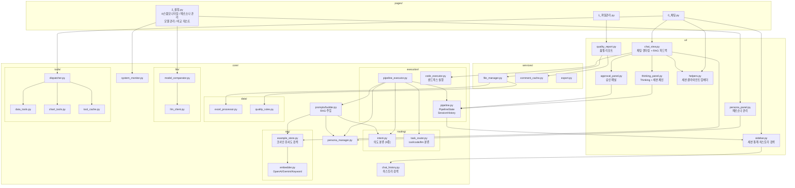
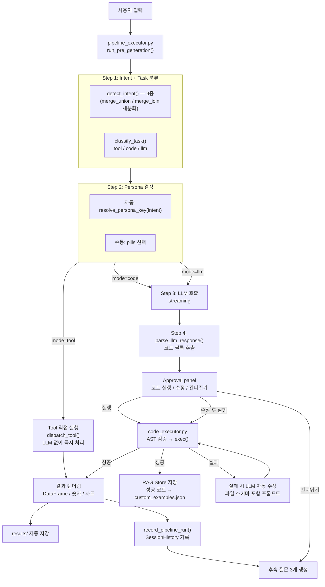
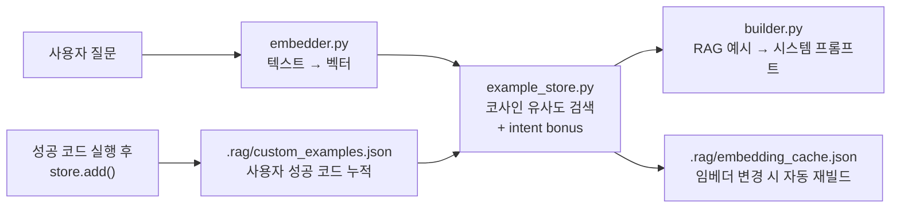
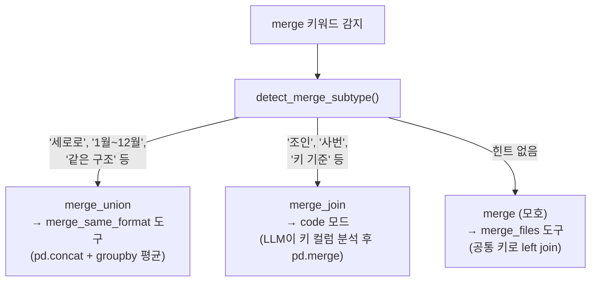
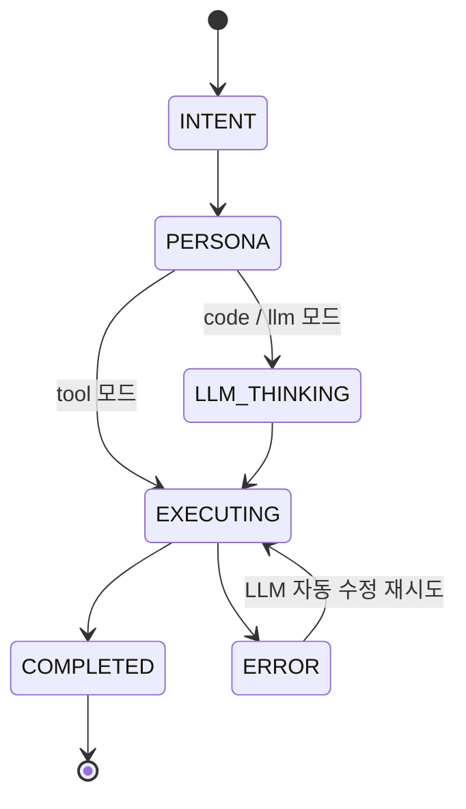
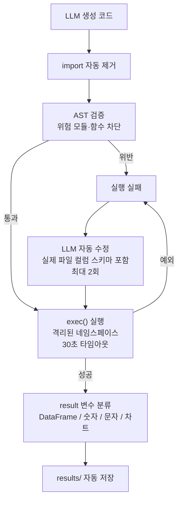
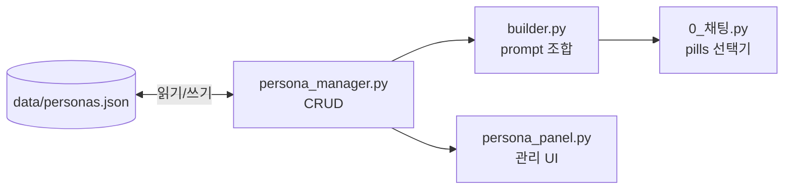
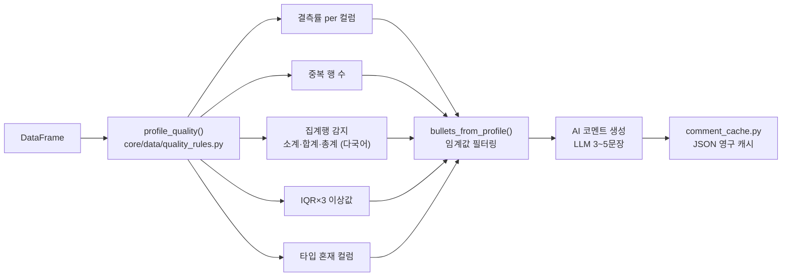

# Excel AI Platform


엑셀·CSV 파일을 업로드하고 AI와 대화하면서 데이터를 분석·변환·병합하는 Streamlit 기반 대화형 앱입니다.

> 작성일: 2026-05-22 (최종 수정: 2026-05-26)

---

## 주요 기능

| 기능 | 설명 |
|------|------|
| 멀티 모델 지원 | Ollama (로컬), Google Gemini, OpenAI GPT — temperature / max_tokens 조절 가능 |
| 파일 관리 | xlsx / xls / csv 다중 업로드, 중복 처리, 멀티 시트 선택, 전체 미리보기 |
| 3-mode 요청 처리 | `tool` (정형 작업 직접 실행) / `code` (LLM 코드 생성+실행) / `llm` (자연어 응답) 자동 분기 |
| Tool 직접 실행 | 필터·집계·정렬·병합·차트 등 정형 요청을 LLM 없이 도구로 즉시 처리 |
| RAG 기반 동적 few-shot 주입 | 사용자 질문을 벡터 유사도로 검색해 가장 관련 있는 코드 예시를 시스템 프롬프트에 자동 주입 |
| 피드백 루프 | 성공한 코드 실행 결과를 자동으로 RAG 스토어에 추가 — 다음 유사 질문의 few-shot 예시로 활용 |
| 분석 히스토리 검색 | 사이드바에서 과거 채팅의 분석 코드를 키워드로 검색, 원클릭으로 채팅에 재사용 |
| merge 의도 세분화 | `merge_union` (구조 동일 → concat) / `merge_join` (키 기준 → merge) 자동 분기 |
| 파일 선택 pills | 채팅 화면에서 분석할 파일을 pill 버튼으로 다중 선택 |
| 페르소나 관리 | 분석가·엔지니어·병합 전문가 등 AI 역할을 화면에서 생성·편집·복제 |
| 채팅 페르소나 선택 | 채팅 중 페르소나를 pill로 즉시 전환 (자동 / 수동) |
| 실행 파이프라인 | Intent → Task 분류 → Persona → LLM/Tool → 파싱 의 단계별 처리 |
| Thinking panel | 각 단계 소요시간·tiktoken 토큰 계산·세션 체인을 접이식 패널로 표시 |
| 세션 실행 히스토리 | 턴별 도구 사용 이력을 `SessionHistory`로 추적, 사이드바에 통계·체인 표시 |
| Approval panel | LLM 코드 확인 후 [실행] / [수정] / [건너뛰기] 선택 |
| 대화 연속성 | 이전 결과(`last_result`)를 다음 질문의 입력으로 자동 체이닝 |
| 멀티헤더 파싱 | 병합 셀 2단 헤더 자동 감지·평탄화 (오탐 방지 로직 포함) |
| 필터 패턴 확장 | 비교·포함·제외·상위/하위·문자열 동등·날짜 범위 등 8가지 패턴 지원 |
| 차트 5종 | 막대·선·파이·산점도(추세선)·히스토그램·박스플롯 자동 생성 |
| 시스템 모니터링 | GPU(nvidia-smi)·CPU·RAM·디스크 실시간 조회 + Ollama VRAM 모델 언로드/로드 |
| 비교 테스트 | 2~3개 페르소나에 동일 프롬프트로 응답·속도 비교 |
| 데이터 품질 프로파일링 | 결측률·중복·집계행·이상값·타입 혼재를 규칙 기반으로 자동 진단 |
| AI 품질 코멘트 | 진단 결과를 LLM이 한국어로 요약 (1회 생성 후 영구 캐시) |
| 코드 오류 자동 수정 | 실행 실패 시 실제 컬럼명 스키마 포함 프롬프트로 LLM이 자동 수정·재실행 |
| 결과 자동 저장 | `result` DataFrame이 있으면 `results/`에 xlsx로 자동 저장·다운로드 |
| 후속 질문 추천 | 답변 후 LLM이 이어서 할 만한 작업 3개를 버튼으로 제안 |
| 대화 내보내기 | 전체 채팅을 `.md` 파일로 저장 |

---

## 빠른 시작
https://excel-ai-agent-nfpaya89ghav4gphg65c3p.streamlit.app/
```bash
# 저장소 클론
git clone https://github.com/sayoon01/excel-ai-agent.git
cd excel-ai-agent

# 실행 (최초 1회 가상환경 생성 및 패키지 설치)
./run.sh
```

브라우저에서 **http://localhost:8501** 접속

### 수동 실행

```bash
python3.12 -m venv venv
source venv/bin/activate
pip install -r requirements.txt
streamlit run app.py
```

### Ollama 로컬 모델

```bash
ollama pull qwen2.5
ollama pull gemma3:27b
```

앱 실행 후 설정 탭에서 설치된 모델이 자동으로 표시됩니다.

---

## 프로젝트 구조

```
excel-platform/
├── app.py                              # st.navigation() 진입점
├── data/
│   └── personas.json                   # 페르소나 데이터 (프리셋 + 커스텀)
├── pages/
│   ├── 0_채팅.py                       # AI 채팅 + 파일·페르소나 선택
│   ├── 1_파일관리.py                    # 업로드, 미리보기, 품질 리포트
│   └── 2_설정.py                       # 4탭: 시스템 모니터링/페르소나 관리/모델 관리/비교 테스트
├── core/                               # 비즈니스 로직 (Streamlit 미사용)
│   ├── routing/                        # Intent / Task 분류
│   │   ├── intent.py                   # 의도 분류 (9종 — merge_union/merge_join 세분화 포함)
│   │   └── task_router.py              # tool/code/llm 3-mode 분류 + classify_task()
│   ├── execution/                      # 코드 실행 / 파이프라인
│   │   ├── code_executor.py            # AST 검증 + exec() 샌드박스 + execute_with_retry
│   │   ├── pipeline.py                 # PipelineState · StageMetrics · SessionHistory · ToolExecution
│   │   └── pipeline_executor.py        # run_pre_generation() · parse_llm_response() · record_pipeline_run()
│   ├── rag/                            # RAG 기반 동적 few-shot 주입
│   │   ├── __init__.py
│   │   ├── embedder.py                 # OpenAIEmbedder / GeminiEmbedder / KeywordEmbedder(한국어 bigram TF-IDF)
│   │   └── example_store.py            # 코사인 유사도 검색 · 커스텀 예시 관리 · 임베딩 캐시
│   ├── data/                           # 엑셀 처리 / 품질 규칙
│   │   ├── excel_processor.py          # 멀티헤더 감지·평탄화 · 사용 범위 탐지
│   │   └── quality_rules.py            # 데이터 품질 프로파일링 규칙
│   ├── llm/                            # LLM 호출 / 모델 비교
│   │   ├── llm_client.py               # OllamaClient / GeminiClient / OpenAIClient
│   │   └── model_comparator.py         # 페르소나 비교 테스트 실행
│   ├── tools/                          # Tool 직접 실행 레이어
│   │   ├── dispatcher.py               # dispatch_tool() — 도구 레지스트리 + 캐시 연동
│   │   ├── data_tools.py               # aggregate / filter / sort / merge_files / merge_same_format
│   │   ├── chart_tools.py              # bar / line / pie / scatter / histogram / boxplot
│   │   ├── file_tools.py               # get_row_count / analyze_missing / get_profile
│   │   └── tool_cache.py               # MD5 키 · mtime 무효화 · TTL 10분 캐시
│   ├── prompts/                        # 프롬프트 빌더
│   │   ├── builder.py                  # 동적 system prompt 조합 + RAG 예시 주입
│   │   ├── code_rules.py               # 코드 생성 규칙 — 파일 통합 3단계 CRITICAL 판단 규칙 포함
│   │   └── examples.py                 # EXAMPLE_CORPUS(18개 RAG 검색 대상) + 정적 fallback EXAMPLES
│   ├── chat_history.py                 # 대화 이력 저장 · search_history() 키워드 검색
│   ├── persona_manager.py              # 페르소나 CRUD + intent 매핑
│   └── system_monitor.py               # GPU/CPU/RAM/디스크 + Ollama VRAM 조회·로드·언로드
├── services/
│   ├── file_manager.py                 # 업로드 · 목록 · 삭제 · 미리보기
│   ├── comment_cache.py                # LLM 품질 코멘트 영구 캐시
│   └── export.py                       # 대화 내보내기 (.md)
├── ui/
│   ├── helpers.py                      # 세션 상태 초기화 · LLM 클라이언트 팩토리 · get_embedder()
│   ├── sidebar.py                      # 사이드바 렌더링 + 세션 통계 + 분석 히스토리 검색
│   ├── chat_view.py                    # 채팅 렌더링 · 코드 실행 · 승인 패널 연동 · RAG 피드백 루프
│   ├── thinking_panel.py               # Thinking process 접이식 패널 + 세션 체인
│   ├── approval_panel.py               # [실행][수정][건너뛰기] 승인 UI
│   ├── quality_report.py               # 품질 리포트 UI
│   ├── persona_panel.py                # 페르소나 관리 UI
│   └── components.py                   # 의도 배지 등 공통 UI
├── .rag/                               # RAG 캐시 (gitignore)
│   ├── embedding_cache.json            # 임베딩 벡터 캐시 (임베더별 무효화)
│   └── custom_examples.json            # 사용자 성공 코드 누적 저장
├── docs/
│   ├── task_classification.md          # 3단계 하이브리드 분류 설계 설명
│   └── tool_execution_design.md        # Tool 실행 아키텍처 개선 설계 (Phase 1/2)
├── tests/
│   └── test_used_range.py
├── uploads/                            # 업로드 파일 (gitignore)
└── results/                            # 결과 파일 · LLM 코멘트 캐시 (gitignore)
```

---

## 레이어 아키텍처



---

## 설계 방향

### 1. 3-mode 요청 처리 흐름

모든 요청은 `task_router.py`의 `classify_task()`가 세 가지 모드 중 하나로 분류합니다.



### 2. RAG 기반 동적 Few-Shot 주입 (`core/rag/`)

사용자 질문을 벡터로 임베딩해 가장 유사한 코드 예시를 시스템 프롬프트에 자동으로 주입합니다.



**임베더 3종:**
| 임베더 | 사용 조건 | 특징 |
|--------|----------|------|
| `OpenAIEmbedder` | OpenAI API 키 설정 시 | `text-embedding-3-small`, 배치 API |
| `GeminiEmbedder` | Gemini API 키 설정 시 | `models/text-embedding-004` |
| `KeywordEmbedder` | API 키 없을 때 자동 폴백 | 한국어 문자 bigram TF-IDF, numpy only |

**검색 우선순위:** 코사인 유사도 + 같은 intent이면 +0.1 보너스 → 상위 k개 반환  
**폴백 체인:** RAG 검색 실패 → 정적 `EXAMPLES` dict → 절대 중단 없음

### 3. merge 의도 세분화

`detect_intent()`가 merge 키워드 감지 시 자동으로 서브타입을 판단합니다.



**merge_files 폴백 개선:** 공통 키 컬럼이 없을 경우 과거의 `pd.concat` 무단 실행 → 현재는 명확한 오류 메시지 반환 + 수직 통합 요청 안내.

### 4. Tool 직접 실행 레이어 (`core/tools/`)

confidence ≥ 0.80인 정형 요청은 LLM을 거치지 않고 도구로 직접 처리합니다.

| 도구 | 처리 내용 |
|------|----------|
| `aggregate_data` | 합계·평균·최대·최소·카운트 + 그룹바이 |
| `filter_rows` | 비교·포함·제외·상위/하위·문자열 동등·날짜 범위 (8패턴) |
| `sort_rows` | 컬럼 기준 오름/내림차순 정렬 |
| `filter_then_sort` | 필터 → 정렬 복합 |
| `create_chart` | 막대·선·파이·산점도·히스토그램·박스플롯 |
| `get_row_count` | 행 수 조회 |
| `analyze_missing` | 결측치 분석 |
| `get_profile` | 컬럼 프로파일 |
| `merge_files` | 키 기반 수평 결합 (공통 키 없으면 오류 반환) |
| `merge_same_format` | 동일 양식 n개 파일 concat → groupby → 평균 통합 |
| `export_data` | 결과 파일 저장 |

**컬럼 추론 3단계** (`_infer_col()`):
1. 문자열 완전 일치
2. 편집 거리 기반 유사 매핑
3. LLM 시맨틱 추론 (confidence 낮을 때)

### 5. 파이프라인 상태 관리 (`core/execution/pipeline.py`)

| 클래스 | 역할 |
|--------|------|
| `PipelineStage` | `INTENT / PERSONA / LLM_THINKING / EXECUTING / COMPLETED / ERROR` |
| `StageMetrics` | 단계별 시작·종료 시각, 소요시간(ms), 부가 정보 |
| `PipelineState` | 전체 파이프라인 입력·출력·메트릭 집계 |
| `ToolExecution` | 단일 턴 실행 레코드 (mode, tool, 성공여부, 소요시간, 결과 행수, 체이닝 여부) |
| `SessionHistory` | 세션 전체 실행 이력 · `chain_str()` · `tool_counts()` · `success_rate()` |



### 6. 의도 분류 — 9종

| 의도 | 감지 키워드 예시 | 연결 페르소나 |
|------|----------------|-------------|
| filter | 필터, 뽑아, 추출, 이상, 이하 | 엔지니어 |
| merge | 병합, 합쳐, 통합, join | 병합 전문가 |
| merge_union | 세로로, 쌓아, 같은 구조, 1~12월, 분기별 | 병합 전문가 |
| merge_join | 조인, 사번, 고객id, 키 기준, 매핑 | 병합 전문가 |
| aggregate | 합계, 평균, 그룹, 집계 | 엔지니어 |
| transform | 변환, 추가, 정렬, 계산 | 엔지니어 |
| analyze | 분석, 통계, 차트, 시각화 | 분석가 |
| export | 저장, 다운로드, 내보내기 | 엔지니어 |
| query | 컬럼, 몇개, 뭐야, 보여줘 | 분석가 |

### 7. 코드 실행 샌드박스



**실행 환경 (import 불필요)**

```python
df = files["파일명.xlsx"]              # 업로드된 파일 dict

result = df[df["항목"] >= 100]         # DataFrame → st.dataframe()
result = {"type": "number", "value": df["금액"].sum()}   # st.metric()
result = {"type": "plot",   "value": fig}                # 인라인 차트
save("결과.xlsx")                      # results/ 저장 + 다운로드 버튼

# n개 파일 체이닝 병합 — reduce 주입됨 (import 불필요)
result = reduce(lambda l, r: pd.merge(l, r, on=key_col, how="left"), dfs)
```

### 8. 차트 지원 (5종 + 추세선)

| 차트 | 키워드 | 특이사항 |
|------|--------|---------|
| 막대 | `막대`, `bar` | 멀티 시리즈, 상위 15개 자동 제한 |
| 선 | `선`, `line`, `추이` | 멀티 시리즈 |
| 파이 | `파이`, `원형` | 상위 8개 |
| 산점도 | `산점도`, `scatter`, `상관` | 추세선 자동 표시 |
| 히스토그램 | `히스토그램`, `분포도` | 자동 bin |
| 박스플롯 | `박스플롯`, `사분위` | 카테고리 컬럼 있으면 그룹별 |

### 9. 페르소나 관리 시스템



- **프리셋**: 편집·복제만 가능, 삭제 불가
- **커스텀**: 생성·편집·복제·삭제 전부 가능
- System Prompt를 비워두면 About + Response style로 자동 생성

### 10. 데이터 품질 프로파일링



### 11. 시스템 모니터링 (`core/system_monitor.py`)

| 항목 | 데이터 소스 |
|------|-----------|
| GPU 사용률 · 온도 · 전력 | `nvidia-smi` CLI |
| CPU · RAM · 디스크 | `psutil` |
| Ollama VRAM 점유 모델 | `GET /api/ps` |
| 설치된 모델 목록 | `GET /api/tags` |
| 모델 로드 / 언로드 | `POST /api/generate` (keep_alive 제어) |

---

## 기술 스택

| 구분 | 사용 |
|------|------|
| UI | Streamlit 1.57 (`st.navigation`, `st.pills`, `st.dialog`) |
| 데이터 | pandas, numpy, openpyxl, xlrd, matplotlib |
| LLM | ollama, google-generativeai, openai |
| 임베딩 | openai (`text-embedding-3-small`), google-generativeai (`text-embedding-004`), numpy TF-IDF (폴백) |
| 토큰 계산 | tiktoken (OpenAI 모델 정확 계산, 그 외 cl100k_base 근사) |
| 시스템 모니터링 | psutil, nvidia-smi (subprocess) |
| 실행 환경 | Python 3.12+ |

---

## 참고 레포지토리

- [SheetPilot](https://github.com/prof-lijar/sheetpilot) — 코드 실행 샌드박스, 파일 관리 구조
- [cowork-llm-lab](https://github.com/YYeoeun/cowork-llm-lab) — 엑셀 헤더 감지, 다중 파일 병합 로직
- [PandasAI](https://github.com/sinaptik-ai/pandas-ai) — 에러 자동 수정, 수치 통계 컨텍스트 주입
- [excelchat-streamlit](https://github.com/frank-flin/excelchat-streamlit) — 대화 히스토리 시스템 프롬프트 주입 구조
