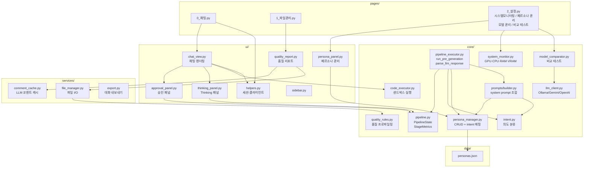
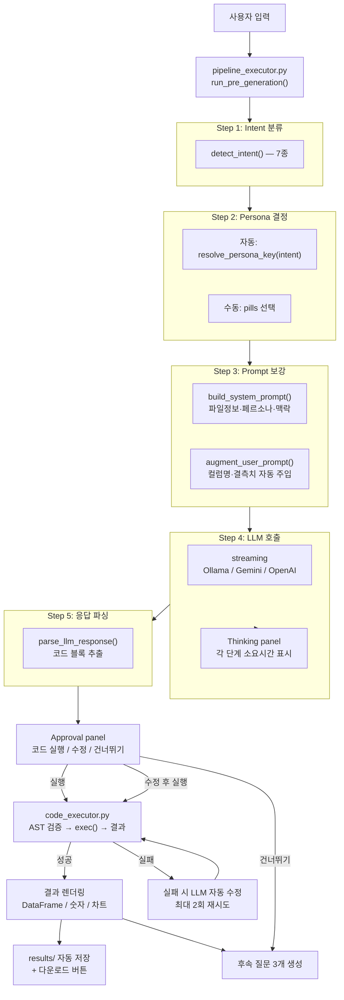
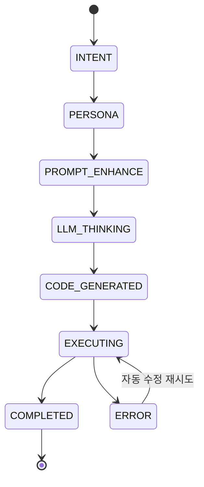
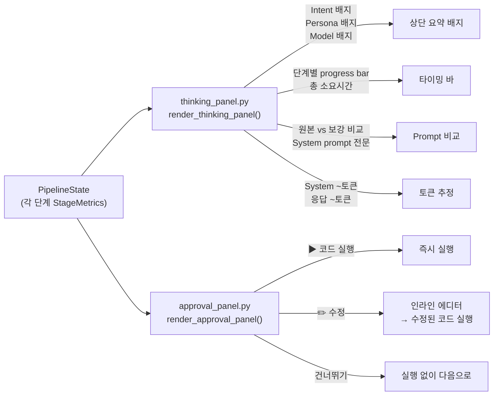
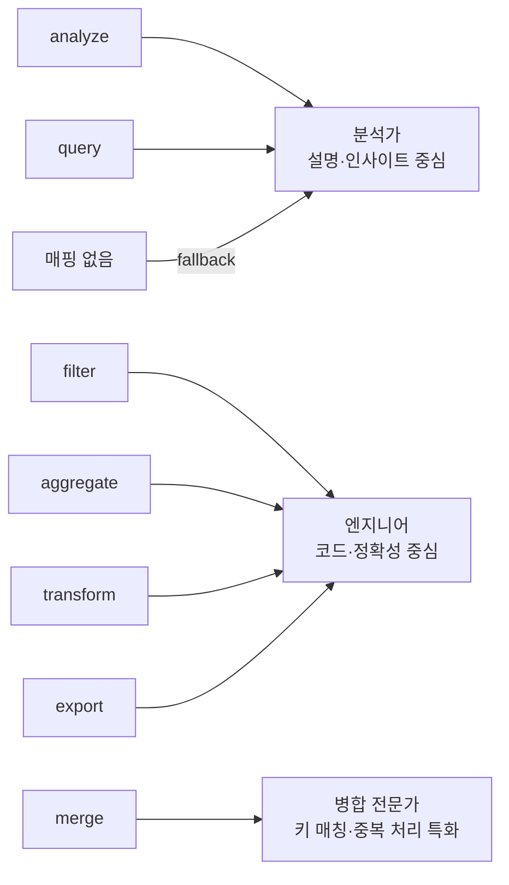
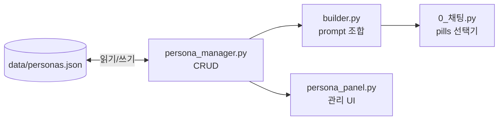
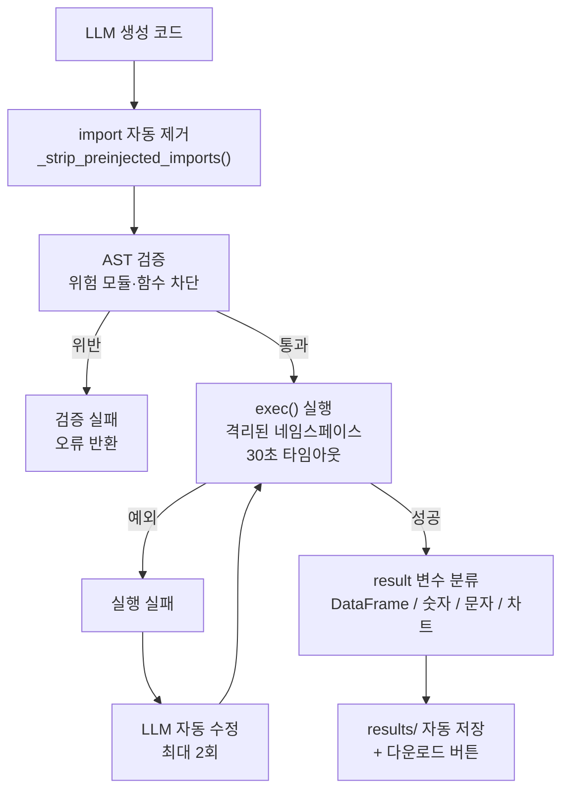
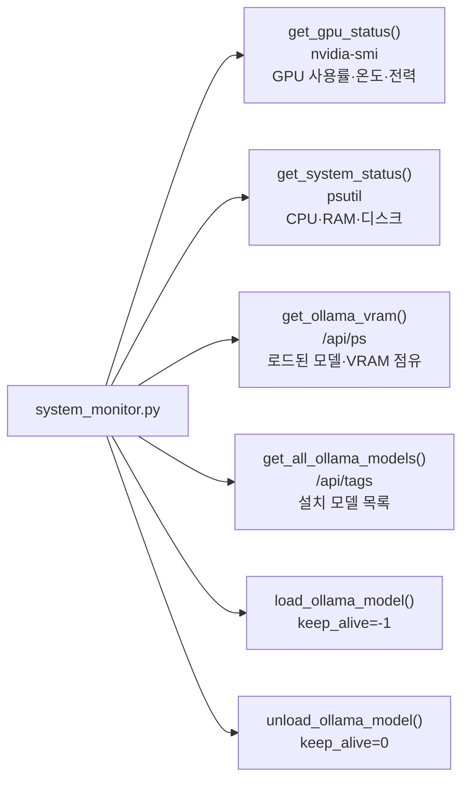
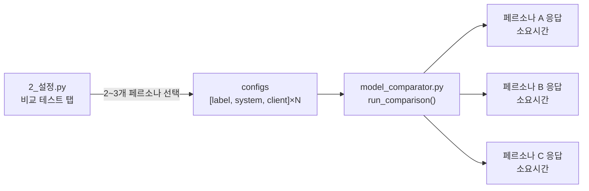
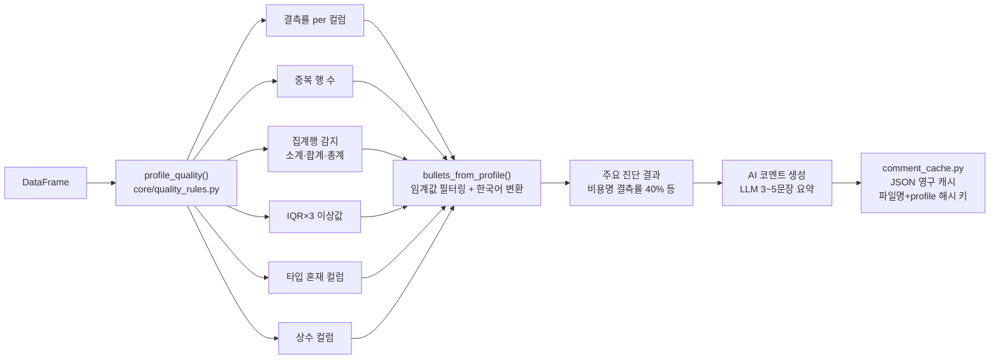

# Excel AI Platform


엑셀·CSV 파일을 업로드하고 AI와 대화하면서 데이터를 분석·변환·병합하는 Streamlit 기반 대화형 앱입니다.

> 작성일: 2026-05-22

---

## 주요 기능

| 기능 | 설명 |
|------|------|
| 멀티 모델 지원 | Ollama (로컬), Google Gemini, OpenAI GPT — temperature / max_tokens 조절 가능 |
| 파일 관리 | xlsx / xls / csv 다중 업로드, 중복 처리, 멀티 시트 선택, 전체 미리보기 |
| 대화형 분석 | 자연어로 질문하면 AI가 pandas 코드를 생성하고 서버에서 실행 |
| 파일 선택 pills | 채팅 화면에서 분석할 파일을 pill 버튼으로 다중 선택 |
| 페르소나 관리 | 분석가·엔지니어·병합 전문가 등 AI 역할을 화면에서 생성·편집·복제 |
| 채팅 페르소나 선택 | 채팅 중 페르소나를 pill로 즉시 전환 (자동 / 수동) |
| 실행 파이프라인 | Intent → Persona → Prompt 보강 → LLM → 파싱 의 5단계 처리 |
| Thinking panel | 각 단계 소요시간 · 토큰 추정 · Prompt 보강 전후 비교를 접이식 패널로 표시 |
| Approval panel | LLM 코드 확인 후 [실행] / [수정] / [건너뛰기] 선택 |
| 시스템 모니터링 | GPU(nvidia-smi) · CPU · RAM · 디스크 실시간 조회 + Ollama VRAM 모델 언로드/로드 |
| 비교 테스트 | 2~3개 페르소나를 선택해 동일 프롬프트로 응답·속도 비교 |
| 데이터 품질 프로파일링 | 결측률·중복·집계행·이상값·타입 혼재를 규칙 기반으로 자동 진단 |
| AI 품질 코멘트 | 진단 결과를 LLM이 한국어로 요약 (1회 생성 후 영구 캐시) |
| 코드 오류 자동 수정 | 실행 실패 시 에러를 LLM에게 돌려보내 수정 코드를 자동 재실행 |
| 결과 자동 저장 | `result` DataFrame이 있으면 `results/`에 xlsx로 자동 저장·다운로드 |
| 후속 질문 추천 | 답변 후 LLM이 이어서 할 만한 작업 3개를 버튼으로 제안 |
| 대화 내보내기 | 전체 채팅을 `.md` 파일로 저장 |

---

## 빠른 시작
https://excel-ai-agent-nfpaya89ghav4gphg65c3p.streamlit.app/
```bash
# 저장소 클론
git clone https://github.com/sayoon01/excel-ai-agent.git
cd excel-ai-agent

# 실행 (최초 1회 가상환경 생성 및 패키지 설치)
./run.sh
```

브라우저에서 **http://localhost:8501** 접속

### 수동 실행

```bash
python3.12 -m venv venv
source venv/bin/activate
pip install -r requirements.txt
streamlit run app.py
```

### Ollama 로컬 모델

```bash
ollama pull qwen2.5
ollama pull gemma3:27b
```

앱 실행 후 설정 탭에서 설치된 모델이 자동으로 표시됩니다.

---

## 프로젝트 구조

```
excel-platform/
├── app.py                          # st.navigation() 진입점
├── data/
│   └── personas.json               # 페르소나 데이터 (프리셋 + 커스텀)
├── pages/
│   ├── 0_채팅.py                   # AI 채팅 + 파일·페르소나 선택
│   ├── 1_파일관리.py                # 업로드, 미리보기, 품질 리포트
│   └── 2_설정.py                   # 4탭: 시스템 모니터링/페르소나 관리/모델 관리/비교 테스트
├── core/                           # 비즈니스 로직 (Streamlit 미사용)
│   ├── llm_client.py               # OllamaClient / GeminiClient / OpenAIClient
│   ├── code_executor.py            # AST 검증 + exec() 샌드박스 + execute_with_retry
│   ├── excel_processor.py          # 헤더 감지 · 사용 범위 탐지
│   ├── intent.py                   # 의도 분류 (7종)
│   ├── persona_manager.py          # 페르소나 CRUD + intent 매핑 (data/personas.json)
│   ├── pipeline.py                 # PipelineState · PipelineStage · StageMetrics
│   ├── pipeline_executor.py        # run_pre_generation() · parse_llm_response()
│   ├── system_monitor.py           # GPU/CPU/RAM/디스크 + Ollama VRAM 조회·로드·언로드
│   ├── model_comparator.py         # 페르소나 비교 테스트 실행
│   ├── quality_rules.py            # 데이터 품질 프로파일링 규칙
│   ├── chat_history.py             # 대화 이력 저장
│   └── prompts/
│       ├── builder.py              # 동적 system prompt 조합 · user prompt 보강
│       ├── code_rules.py           # 코드 생성 규칙
│       └── examples.py             # intent별 few-shot 예시
├── services/
│   ├── file_manager.py             # 업로드 · 목록 · 삭제 · 미리보기
│   ├── comment_cache.py            # LLM 품질 코멘트 영구 캐시
│   └── export.py                   # 대화 내보내기 (.md)
├── ui/
│   ├── helpers.py                  # 세션 상태 초기화 · LLM 클라이언트 팩토리
│   ├── sidebar.py                  # 사이드바 렌더링
│   ├── chat_view.py                # 채팅 렌더링 · 코드 실행 · 승인 패널 연동
│   ├── thinking_panel.py           # Thinking process 접이식 패널
│   ├── approval_panel.py           # [실행][수정][건너뛰기] 승인 UI
│   ├── quality_report.py           # 품질 리포트 UI
│   ├── persona_panel.py            # 페르소나 관리 UI
│   └── components.py               # 의도 배지 등 공통 UI
├── docs/
│   ├── persona_system_design.md
│   └── architecture_comparison.md
├── uploads/                        # 업로드 파일 (gitignore)
└── results/                        # 결과 파일 · LLM 코멘트 캐시 (gitignore)
```

---

## 레이어 아키텍처



---

## 설계 방향

### 1. 전체 요청 처리 흐름



### 2. 파이프라인 상태 관리 (`core/pipeline.py`)

각 요청은 `PipelineState` 객체 하나에 전체 실행 결과를 누적합니다.

| 클래스 | 역할 |
|--------|------|
| `PipelineStage` | `INTENT / PERSONA / PROMPT_ENHANCE / LLM_THINKING / CODE_GENERATED / EXECUTING / COMPLETED / ERROR` 열거형 |
| `StageMetrics` | 단계별 시작·종료 시각, 소요시간(ms), 부가 정보 |
| `PipelineState` | 전체 파이프라인 입력·출력·메트릭 집계 |



### 3. Thinking panel / Approval panel



### 4. 동적 프롬프트 구성

**의도 감지 — 7종 분류**

| 의도 | 감지 키워드 예시 | 연결 페르소나 |
|------|----------------|-------------|
| filter | 필터, 뽑아, 추출, 이상, 이하 | 엔지니어 |
| merge | 병합, 합쳐, 통합, join | 병합 전문가 |
| aggregate | 합계, 평균, 그룹, 집계 | 엔지니어 |
| transform | 변환, 추가, 정렬, 계산 | 엔지니어 |
| analyze | 분석, 통계, 차트, 시각화 | 분석가 |
| export | 저장, 다운로드, 내보내기 | 엔지니어 |
| query | 컬럼, 몇개, 뭐야, 보여줘 | 분석가 |

**페르소나 3종 + 커스텀**



**사용자 프롬프트 자동 보강**

```
[입력]  "이거 합쳐줘"

[LLM이 실제로 받는 것]
이거 합쳐줘

---
[자동 컨텍스트]
요청에서 언급된 컬럼: 날짜
주의 — 'b.xlsx' 결측치: 담당자(12개)
직전 작업 결과(last_result): 500행 × 3열, 컬럼: 날짜, 매출, 지역
```

### 5. 페르소나 관리 시스템

페르소나 데이터를 `data/personas.json`에 저장해 코드 수정 없이 화면에서 관리합니다.



- **프리셋**: 편집·복제만 가능, 삭제 불가
- **커스텀**: 생성·편집·복제·삭제 전부 가능
- System Prompt를 비워두면 About + Response style로 자동 생성

### 6. 코드 실행 샌드박스



**실행 환경 (import 불필요)**

```python
df = files["파일명.xlsx"]       # 업로드된 파일 dict

result = df[df["매출"] >= 100]  # DataFrame 반환 → st.dataframe()
result = {"type": "number", "value": df["매출"].sum()}   # st.metric()
result = {"type": "plot",   "value": fig}                # 인라인 차트
save("결과.xlsx")               # results/ 저장 + 다운로드 버튼
```

### 7. 시스템 모니터링 (`core/system_monitor.py`)

설정 페이지의 **시스템 모니터링** 탭에서 실시간 자원 현황을 확인할 수 있습니다.



| 항목 | 데이터 소스 |
|------|-----------|
| GPU 사용률 · 온도 · 전력 | `nvidia-smi` CLI |
| CPU · RAM · 디스크 | `psutil` |
| Ollama VRAM 점유 모델 | `GET /api/ps` |
| 설치된 모델 목록 | `GET /api/tags` |
| 모델 로드 / 언로드 | `POST /api/generate` (keep_alive 제어) |

### 8. 비교 테스트 (`core/model_comparator.py`)

설정 페이지의 **비교 테스트** 탭에서 2~3개 페르소나에 동일 프롬프트를 실행해 응답과 응답 속도를 나란히 비교합니다.



### 9. 데이터 품질 프로파일링



---

## 기술 스택

| 구분 | 사용 |
|------|------|
| UI | Streamlit 1.57 (`st.navigation`, `st.pills`, `st.dialog`) |
| 데이터 | pandas, numpy, openpyxl, xlrd, matplotlib |
| LLM | ollama, google-generativeai, openai |
| 시스템 모니터링 | psutil, nvidia-smi (subprocess) |
| 실행 환경 | Python 3.12+ |

---

## 참고 레포지토리

- [SheetPilot](https://github.com/prof-lijar/sheetpilot) — 코드 실행 샌드박스, 파일 관리 구조
- [cowork-llm-lab](https://github.com/YYeoeun/cowork-llm-lab) — 엑셀 헤더 감지, 다중 파일 병합 로직
- [PandasAI](https://github.com/sinaptik-ai/pandas-ai) — 에러 자동 수정, 수치 통계 컨텍스트 주입
- [excelchat-streamlit](https://github.com/frank-flin/excelchat-streamlit) — 대화 히스토리 시스템 프롬프트 주입 구조
