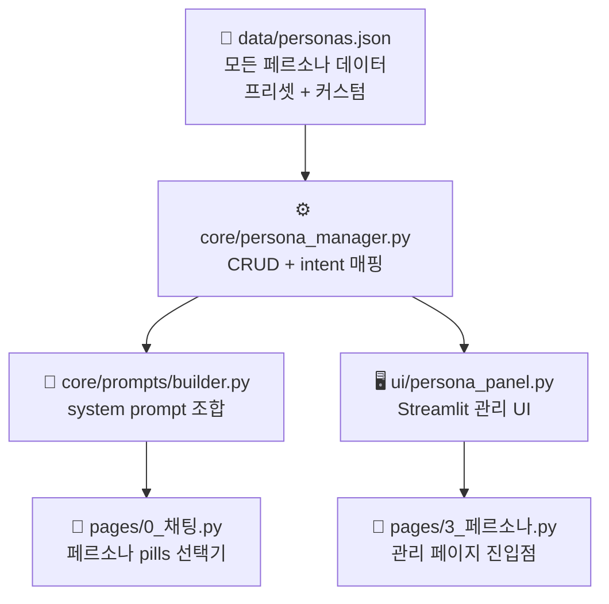
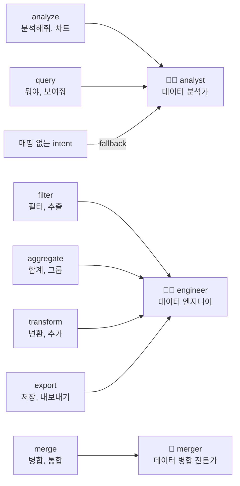
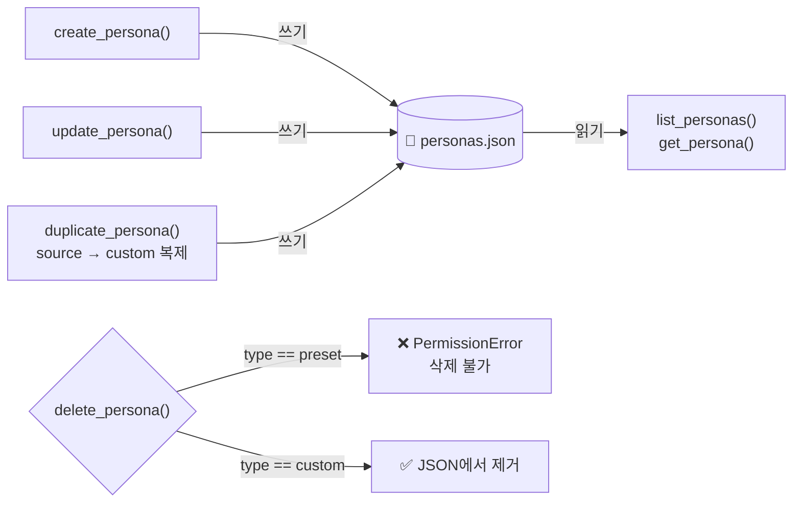
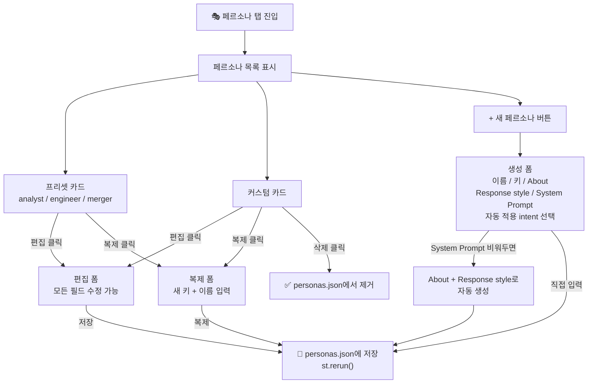
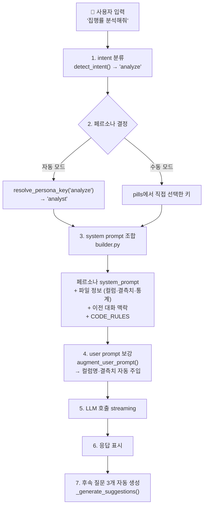

# 페르소나 기반 Prompt 시스템 가이드

## 구조 한눈에 보기



핵심 원칙: **데이터(JSON)와 로직(Python)을 분리**  
페르소나를 추가·수정할 때 코드를 건드리지 않고 화면에서 직접 관리합니다.

---

## personas.json 스키마

**위치:** `data/personas.json`

```json
{
  "personas": {
    "analyst": {
      "name": "데이터 분석가",
      "description": "숫자를 해석하고 패턴을 발견해 설명하는 전문가",
      "type": "preset",
      "about": "한국어로 대화하는 데이터 분석 전문가",
      "response_style": "친근하고 간결하게, 핵심 2가지 이내",
      "system_prompt": "## 역할\n당신은 ...",
      "intents": ["analyze", "query"],
      "created_at": "2026-05-22T00:00:00",
      "updated_at": "2026-05-22T00:00:00"
    }
  },
  "default_persona": "analyst",
  "intent_fallback": "analyst"
}
```

### 필드 설명

| 필드 | 타입 | 설명 |
|---|---|---|
| `name` | string | 화면에 표시할 이름 (한국어) |
| `description` | string | 한 줄 요약 |
| `type` | `"preset"` \| `"custom"` | 프리셋은 삭제 불가, 커스텀은 자유 |
| `about` | string | 이 페르소나가 어떤 역할인지 설명 |
| `response_style` | string | 말투·응답 스타일 요약 |
| `system_prompt` | string | LLM에 실제 전달되는 전체 텍스트 |
| `intents` | list[str] | 이 페르소나가 자동 선택되는 intent 목록 |

---

## Intent → Persona 자동 매핑



---

## persona_manager.py — CRUD 흐름



### resolve_persona_key

```python
# intent에 매핑된 페르소나 키 반환
# 매핑 없으면 intent_fallback("analyst") 반환
key = resolve_persona_key("filter")  # → "engineer"
key = resolve_persona_key("merge")   # → "merger"
key = resolve_persona_key("analyze") # → "analyst"
```

---

## builder.py — system prompt 조합

**위치:** `core/prompts/builder.py`

```python
def build_system_prompt(
    files_info: list[dict],
    intent: str = "query",
    compact: bool = False,
    last_result_info: dict | None = None,
    recent_messages: list[dict] | None = None,
    persona_key: str | None = None,  # None = intent 자동 결정
) -> str:
    _key = persona_key or resolve_persona_key(intent)
    p = get_persona(_key) or get_persona("analyst")
    persona = p["system_prompt"]
    # ... 파일 정보, 예시, CODE_RULES 조합
```

`persona_key`를 넘기면 intent 무관하게 해당 페르소나 고정.  
`None`이면 intent → persona 자동 매핑.

---

## 채팅 페이지 — 페르소나 선택기

**위치:** `pages/0_채팅.py`

파일 pills 바로 아래에 페르소나 pills 한 줄이 표시됩니다.

```
[4예실대비표.xlsx] [5예실대비표.xlsx]                        2/3
[자동] [데이터 분석가] [데이터 엔지니어] [데이터 병합 전문가]  페르소나
```

- **자동** (기본): 질문 intent를 분석해서 페르소나 자동 결정
- **직접 선택**: intent 무관하게 해당 페르소나 고정

선택된 페르소나 키는 `st.session_state.selected_persona_key`에 저장됩니다.

---

## 페르소나 관리 UI 흐름



---

## 전체 Prompt 처리 흐름



---

## 커스텀 페르소나 System Prompt 작성 팁

```markdown
## 역할
당신은 [역할]입니다. [핵심 목적]이 핵심 역할입니다.

## 말투와 태도
- [구체적인 행동 지침]
- 이모지를 헤더나 항목 앞에 붙이지 마세요.
- "다음 단계 제안" 섹션을 응답 안에 직접 작성하지 마세요.

## 작업 방법론
1. 요청이 모호하면 → [어떻게 확인할지]
2. 의도가 명확하면 → [어떻게 처리할지]
3. 파일이 없으면 → 업로드 안내 후 멈추기
```

**피해야 할 것:**
- 너무 긴 역할 설명 (3~5줄이면 충분)
- 이미 CODE_RULES에 있는 내용 중복 작성
- 특정 파일명·컬럼명 하드코딩 (범용성 감소)
