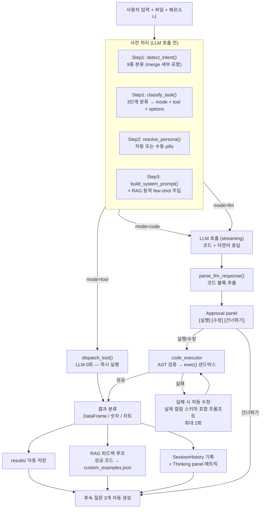
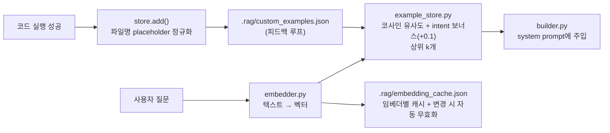
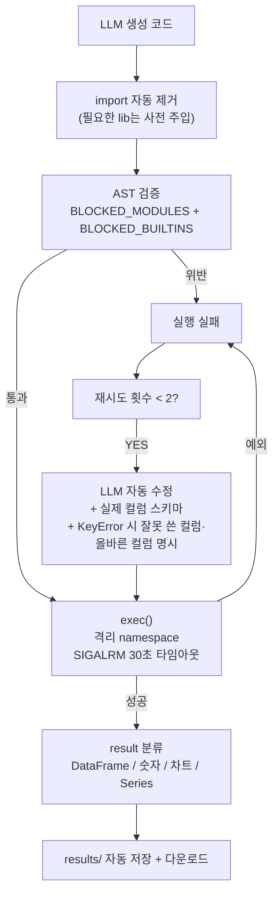
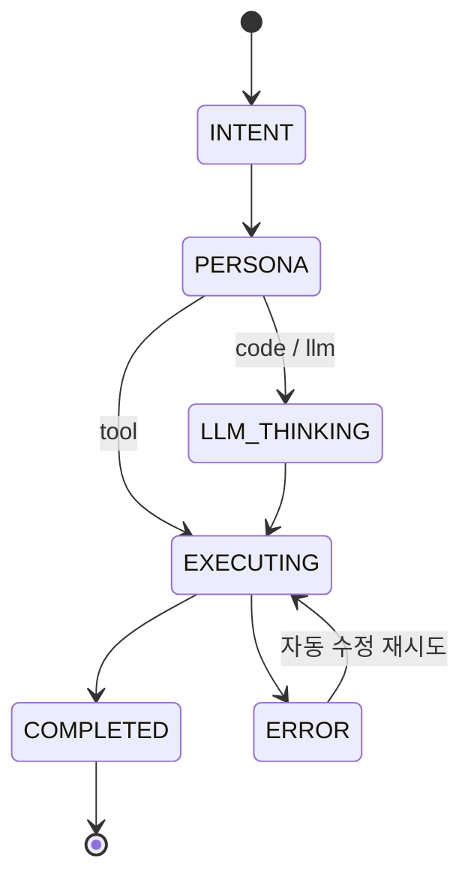

# Excel AI Platform — 진행 상황 보고

> 작성일: 2026-06-08
> 대상: 진행 상황 회의 / 상위 보고
> 작성 기준: `main` 브랜치 기준 최신 커밋 (`a6ccc29`)

---

## 1. 한눈에 보기

엑셀·CSV 파일을 업로드하면 LLM과 대화하며 데이터를 **분석·변환·병합·시각화**하는 Streamlit 대화형 앱입니다.
실 사용자는 비개발자(현업 담당자)를 가정했고, "사용자가 자연어로 요청 → 시스템이 자동으로 가장 적합한 실행 경로를 선택해 결과를 즉시 보여주는" 것이 1순위 목표입니다.

| 항목 | 현황 |
|------|------|
| 개발 단계 | **MVP 완성 → 안정화·정확도 개선 페이즈** |
| 핵심 기능 | 모두 동작 (3-mode 라우팅, 11종 도구, RAG 동적 few-shot, 코드 샌드박스, 자동 수정, 차트 5종, 페르소나) |
| 코드베이스 규모 | Python ~6,000 LOC, 5개 레이어(`pages`/`ui`/`services`/`core`/`tests`) |
| 지원 LLM | Ollama(로컬), Google Gemini, OpenAI GPT |
| 배포 | Streamlit Cloud 데모: `excel-ai-agent-nfpaya89ghav4gphg65c3p.streamlit.app` |
| 다음 마일스톤 | 결과 해석 LLM 1회 추가(Phase 1) → Tool Calling 정밀 모드(Phase 2) |

---

## 2. 핵심 설계 사상

### 2.1 "LLM은 비싸다 — 안 써도 되는 곳에선 쓰지 않는다"

매 요청마다 LLM을 부르면 **느리고 비싸고 부정확**합니다.
대신 **3단계 분류 → 80%는 LLM 없이 처리**하는 구조를 채택했습니다.

```
사용자 요청
   │
   ▼
[1차] Rule 분류 (키워드 테이블)        ← 비용 0, 약 80% 요청 처리
   │  confidence ≥ 0.80 ?  ─── YES ──> 즉시 실행
   │  NO
   ▼
[2차] LLM 분류 (JSON 1회 호출)         ← 애매한 요청만
   │  confidence ≥ 0.60 ?  ─── YES ──> 실행
   │  NO
   ▼
[3차] Code Fallback + 사람 확인        ← 불확실하면 안전하게 코드+승인패널
```

**의도(Intent) 분류 + 실행모드(Task) 분류를 분리**한 것이 핵심입니다.
- **Intent** (9종): `filter / merge_union / merge_join / aggregate / transform / analyze / export / query` — "무엇을 하고 싶은가"
- **Task mode** (3종): `tool / code / llm` — "어떻게 실행할 것인가"

같은 "병합" 의도여도 같은 양식을 세로로 쌓는 건 `merge_same_format` 도구로 즉시, 키 컬럼 기반 조인은 LLM 코드 생성으로 분기시킵니다.

### 2.2 "코드 생성 vs Tool Calling — 둘 다 쓴다 (하이브리드)"

엑셀 분석은 요청 다양성이 극도로 높습니다.
> *"집행률 80% 미만이고 전년 대비 감소한 항목만 부서별로 합산한 다음 상위 5개"*

이런 복합 조건을 일일이 함수로 미리 정의하는 건 불가능합니다.
반대로 *"행수 알려줘"* 같은 정형 요청에 매번 LLM이 pandas 코드를 새로 짜는 것도 낭비입니다.

→ **정형 작업은 Tool 직접 실행, 비정형 작업은 LLM 코드 생성** 으로 이원화했습니다.

| | Tool 모드 | Code 모드 | LLM 모드 |
|---|---|---|---|
| **언제** | confidence ≥ 0.80 정형 요청 | 복합·다단계 분석 | 설명·해석 질문 |
| **LLM 호출** | 0회 | 1회 + 실패 시 자동 수정 | 1회 |
| **실행** | 미리 정의된 함수 직접 호출 | AST 검증 + `exec()` 샌드박스 | 텍스트 응답만 |
| **사용자 승인** | 불필요 | Approval panel 표시 | 불필요 |
| **예시** | "합계 구해줘", "행수 알려줘" | "필터+정렬 후 그룹 평균" | "이 데이터 뭐야" |

---

## 3. 전체 실행 파이프라인



---

## 4. 주요 기술 컴포넌트

### 4.1 3-mode Task 라우팅 (`core/routing/task_router.py`)

LLM 비용을 최소화하면서 정확도를 끌어올리기 위해 **rule → LLM → fallback** 3단 분류기를 직접 설계했습니다.

| 단계 | 비용 | 처리 범위 | 폴백 조건 |
|------|------|----------|----------|
| 1차 rule | 0 | 명확한 정형 요청 (~80%) | confidence < 0.80 |
| 2차 LLM JSON 분류 | LLM 1회 | 애매한 요청 | confidence < 0.60 |
| 3차 code + Approval | LLM 1회 + 사람 확인 | 불확실한 요청 | — |

**복합 의도 처리 로직(최근 추가):**
- "**N행 뽑아서 합계**" → `head_aggregate` 도구로 직접 처리 (정규식 + 키워드 동시 매칭, confidence 0.95)
- "필터 + 집계" 동시 키워드 → 단일 도구로 처리 불가 → code 모드로 격상 (confidence 0.82)
- "차트 + 컬럼" 동시 → `create_chart` 우선 (`get_profile`과의 충돌 방지)
- "통합 + 평균" 동시 → `merge_same_format` 강제 (`aggregate_data` 0.92보다 높은 0.96)

### 4.2 의도 분류 — `merge`만 3종으로 세분화 (`core/routing/intent.py`)

병합은 **수직(concat) vs 수평(join) 판단을 잘못하면 결과가 완전히 달라지는** 위험 작업이라 별도로 세분화했습니다.

| 서브타입 | 트리거 힌트 | 실행 경로 |
|---------|------------|----------|
| `merge_union` | "세로로", "쌓아", "1월/2월/3월…", "분기별", "같은 양식" | `merge_same_format` 도구 — concat + 소계 행 자동 분리/재부착 + groupby 평균 |
| `merge_join` | "조인", "사번", "고객id", "키 기준", "매핑" | code 모드 — LLM이 키 컬럼 분석 후 `pd.merge` 코드 생성 |
| `merge` (모호) | 위 힌트 없음 | `merge_files` 도구 — 공통 키 자동 탐지 후 left join (실패 시 명확한 오류 반환) |

**최근 수정한 버그:**
- `merge_union` 감지 후 `task_router` 키워드 루프가 결과를 덮어쓰는 우선순위 버그 → intent 결과를 키워드 루프보다 먼저 평가하도록 변경
- merge 힌트 점수가 기존 merge 점수에 이중 누적되어 "1월 합계" 같은 단순 집계가 merge로 오분류 → 누적 가산 제거

### 4.3 RAG 기반 동적 Few-Shot 주입 (`core/rag/`)

매번 정적 예시를 전부 시스템 프롬프트에 넣으면 **토큰이 폭증**하고 LLM 정확도가 떨어집니다.
사용자 질문을 **벡터로 임베딩 → 코사인 유사도로 가장 관련 있는 예시 2개만 동적 주입**합니다.



**임베더 3종 — API 키가 없어도 동작:**
| 임베더 | 사용 조건 | 모델 |
|--------|----------|------|
| `OpenAIEmbedder` | OPENAI_API_KEY 있을 때 | `text-embedding-3-small` (배치 API) |
| `GeminiEmbedder` | GEMINI_API_KEY 있을 때 | `models/text-embedding-004` |
| `KeywordEmbedder` | 키 없을 때 자동 폴백 | 한국어 문자 bigram TF-IDF, numpy only |

**3단 안전망:**
1. RAG 검색 성공 → 가장 유사한 예시 주입
2. 임베딩 API 실패 → keyword 폴백
3. 전부 실패 → intent 기반 정적 `EXAMPLES` dict → **절대 중단 없음**

### 4.4 Tool 직접 실행 레이어 (`core/tools/`)

LLM을 거치지 않는 11개 도구. 각 도구는 자체 파라미터 파싱 + 캐시 + LLM 의미 매칭 폴백을 갖습니다.

| 도구 | 처리 |
|------|------|
| `get_row_count` / `analyze_missing` / `get_profile` | 파일 메타 조회 |
| `aggregate_data` | sum/mean/max/min/count + groupby |
| `filter_rows` | 8가지 패턴 (비교, 포함, 제외, 상위/하위, 문자열 동등, 날짜 범위) |
| `sort_rows` / `filter_then_sort` | 정렬 + 필터·정렬 체이닝 |
| `merge_files` | 공통 키 기반 left join (키 없으면 명확한 오류 반환) |
| `merge_same_format` | 동일 양식 n개 파일 — **소계 행 분리 → concat → groupby 평균 → 소계 행 재부착** |
| `head_aggregate` | "N행 뽑아서 합계" 패턴 전용 |
| `create_chart` | 막대·선·파이·산점도(추세선)·히스토그램·박스플롯 |
| `export_data` | 결과 파일 저장 |

**컬럼 추론 3단 (`_infer_col`):**
1. 문자열 완전/부분 일치 (대소문자 무시)
2. 편집거리 ≤ 1 (오타 허용)
3. LLM 의미 매칭 (실제 컬럼 목록 전달 → 캐시)
→ **하드코딩된 동의어 사전 없음** → 어떤 도메인 파일이든 동작

**도구 캐시 (`tool_cache.py`):** MD5 키(파일+파라미터) + mtime 무효화 + 10분 TTL.
같은 파일에 같은 도구를 반복 호출해도 두 번째부터는 즉시 반환.

### 4.5 코드 샌드박스 (`core/execution/code_executor.py`)

LLM이 생성한 임의 Python 코드를 **안전하게 실행**하기 위한 다층 방어:



**실행 환경 (import 불필요 — 사전 주입):**
```python
df = files["sales.xlsx"]                          # 업로드된 파일 dict
result = df[df["매출"] >= 1000]                   # DataFrame
result = {"type": "number", "value": df.sum()}    # 숫자
result = {"type": "plot",   "value": fig}         # 차트
save("결과.xlsx")                                  # 자동 저장
result = reduce(lambda l, r: pd.merge(l, r, on=key), dfs)   # n개 체이닝
```

**최근 개선:**
- **다중 파일 접근 원칙** (`code_rules.py`): 파일명을 지목하지 않은 요청은 `files.items()` 전체 순회 원칙 명시 → LLM이 한 파일만 접근하는 패턴 차단
- **auto_compact**: 파일 5개 이상 또는 대화 10턴 이상이면 system prompt를 자동 축약 (토큰 낭비 방지)
- **KeyError 힌트**: 자동 수정 프롬프트에 잘못 사용한 컬럼명 + 올바른 컬럼 목록을 함께 전달 → 수정 정확도 상승

### 4.6 파이프라인 상태 관리 (`core/execution/pipeline.py`)

각 턴의 실행 흐름을 **stage 단위로 측정·기록**해서 Thinking panel과 SessionHistory에 표시합니다.



| 클래스 | 역할 |
|--------|------|
| `PipelineStage` | enum — `INTENT / PERSONA / LLM_THINKING / EXECUTING / COMPLETED / ERROR` |
| `StageMetrics` | 단계별 시작·종료 시각, 소요시간(ms), 부가 정보 |
| `PipelineState` | 한 턴 전체의 입출력·메트릭 집계 |
| `ToolExecution` | 한 턴의 실행 레코드 (mode, tool, success, duration, rows, chained) |
| `SessionHistory` | 세션 누적 — `chain_str()`, `tool_counts()`, `success_rate()` |

→ 사이드바에 **세션 성공률 / 도구 사용 빈도 / 실행 체인** 실시간 표시
→ `tiktoken`으로 system prompt + 응답 **정확한 토큰 수** 계산 (OpenAI 모델은 모델별 인코딩, 그 외는 cl100k_base 근사)

### 4.7 RAG 피드백 루프

이게 시간이 지날수록 정확도가 **자동으로 올라가는** 핵심 메커니즘입니다.

```
사용자 질문 → LLM 코드 생성 → 실행 성공
                                  ↓
                  ExampleStore.add(query, intent, code, files_info)
                                  ↓
                  파일명을 {FILE_A} placeholder로 정규화
                                  ↓
                  .rag/custom_examples.json에 누적
                                  ↓
            다음 유사 질문이 들어오면 → 자동으로 few-shot 예시로 주입
```

→ **사용자가 쓸수록 똑똑해지는 구조**.
→ 정규화 덕분에 파일명이 바뀌어도 패턴이 일반화됨.

---

## 5. 최근 4주 진행 사항

| 일자 | 커밋 | 내용 |
|------|------|------|
| 2026-05-27 | `a6ccc29` | `head_aggregate` 도구 / 복합 의도 라우팅(필터+집계, 차트+컬럼) / 다중 파일 접근 원칙 |
| 2026-05-27 | `840a60c` | README·CODE_REVIEW 현행화 |
| 2026-05-27 | `7c7358f` | `merge_same_format` 소계/합계 행 분리·재부착 처리, Ollama 기본 모델 `gemma3:27b` |
| 2026-05-26 | `49ade8f` | merge 라우팅 우선순위 버그 수정 / 컬럼 힌트 강화 |
| 2026-05-26 | `691a9fb` | **RAG 예제 검색 도입** / merge 세부 분류 / 프롬프트·UI 확장 |
| 2026-05-22 | `63cedcb` | Prompt 보강 단계 제거 → 파이프라인 단순화 |
| 2026-05-22 | `7084b61` | `core` 모듈 분리(routing/execution/rag/data/llm/tools/prompts) — 레이어 아키텍처 확정 |
| 2026-05-22 | `9997c77` | **태스크 라우터 + 도구 레이어 도입** — 3-mode 분류 도입 |
| 2026-05-22 | `461ac8c` | 파이프라인 단계 추적 + Approval UI + 아키텍처 문서 |

**의미 있는 전환점:**
1. **5/22 — 3-mode 라우팅 도입**: LLM 단일 경로 → tool/code/llm 분기로 비용·정확도 동시 개선
2. **5/22 — core 레이어 분리**: 단일 파일 구조 → 도메인별 모듈 → 테스트·유지보수성 확보
3. **5/26 — RAG 동적 few-shot**: 정적 예시 → 코사인 유사도 기반 동적 주입 → 토큰 절감 + 정확도 상승
4. **5/27 — merge 세부 분류·소계 행 처리**: 예실대비표 같은 실무 예산 파일 통합 정상화

---

## 6. 데이터 품질 / 안정성 장치

수치를 다루는 도구라 **데이터 신뢰성**이 곧 제품 신뢰성입니다. 다음 장치를 도입했습니다.

| 장치 | 위치 | 효과 |
|------|------|------|
| 멀티헤더 자동 감지·평탄화 | `core/data/excel_processor.py` | 병합 셀 2단 헤더를 자동으로 단일 헤더화 (오탐 방지 로직 포함) |
| ffill 소계 행 복원 | `core/data/excel_processor.py` | 병합 셀로 NaN→ffill로 오염된 소계 행의 앵커 컬럼 자동 복원 |
| 소계/합계 행 자동 제거 | `merge_same_format` 도구 | groupby 전에 `소 계`/`합계`/`총계` 행을 다국어·벡터화 탐지로 분리 → 통합 후 재부착 |
| 데이터 품질 프로파일링 | `core/data/quality_rules.py` | 결측률·중복·집계행·IQR×3 이상값·타입 혼재 규칙 기반 진단 |
| AI 품질 코멘트 + 영구 캐시 | `services/comment_cache.py` | 진단 결과를 LLM이 3~5문장으로 한국어 요약 (파일별 1회 생성 후 캐시) |
| 코드 실행 자동 수정 | `core/execution/code_executor.py` | 실패 시 실제 컬럼 스키마 포함 프롬프트로 LLM 재시도 (최대 2회) |
| Series → DataFrame 자동 변환 | `core/execution/code_executor.py` | `.sum()` 등 Series 반환을 "항목\|값" 2열 표로 자동 변환 |
| 결과 파일 자동 저장 | `core/execution/code_executor.py` | `result` DataFrame이 있으면 `results/`에 xlsx로 즉시 저장 + 다운로드 버튼 |

---

## 7. 시스템 모니터링 (`core/system_monitor.py`)

로컬 Ollama 운영을 가정해 **GPU/VRAM/모델 상태**까지 한 화면에서 관리합니다.

| 항목 | 데이터 소스 |
|------|-----------|
| GPU 사용률·온도·전력 | `nvidia-smi` CLI |
| CPU·RAM·디스크 | `psutil` |
| Ollama VRAM 점유 모델 | `GET /api/ps` |
| 설치된 모델 목록 | `GET /api/tags` |
| 모델 로드/언로드 | `POST /api/generate` (`keep_alive` 제어) |

→ 설정 페이지에서 **모델 비교 테스트(2~3개 페르소나 동시 호출 → 응답·속도 비교)** 가능

---

## 8. 기술 스택

| 구분 | 사용 |
|------|------|
| UI | Streamlit 1.57 (`st.navigation`, `st.pills`, `st.dialog`) |
| 데이터 | pandas, numpy, openpyxl, xlrd, matplotlib |
| LLM | ollama, google-generativeai, openai |
| 임베딩 | `text-embedding-3-small`, `text-embedding-004`, numpy TF-IDF 폴백 |
| 토큰 계산 | tiktoken |
| 모니터링 | psutil, nvidia-smi(subprocess) |
| 런타임 | Python 3.12+ |

**의존성 외부 서비스:** 없음. 모든 LLM·임베딩은 키 없이도(Ollama + KeywordEmbedder) 100% 로컬 운영 가능.

---

## 9. 알려진 한계 / 의사결정 사항

| 이슈 | 현재 상태 | 향후 대응 |
|------|----------|----------|
| **Tool 결과 해석 부재** | "16행 추출됨" 같은 기계적 요약만 표시 | **Phase 1**: Tool 실행 후 LLM 1회 호출 → 맥락 있는 한국어 답변 (`docs/tool_execution_design.md` 참조) |
| **휴리스틱 파라미터 파싱** | "매출 1000 이상" 같은 표현을 도구 내부 정규식으로 파싱 → 복잡 조건 한계 | **Phase 2**: Native Function Calling (OpenAI/Gemini) + Ollama는 JSON 모드 폴백 |
| **Ollama 모델별 function calling 미지원** | 일부 Ollama 모델만 지원 | JSON 모드 폴백으로 우회 |
| **임의 코드 실행 보안** | AST 차단 + 격리 namespace + 30초 타임아웃 + Approval panel | 현재 수준이 적절. 추가 강화는 컨테이너 격리(컨테이너 오버헤드 vs 안전성 트레이드오프) |
| **대화 토큰 누적** | auto_compact (파일≥5 또는 대화≥10턴 → 시스템 프롬프트 축약) | OK |
| **다국어** | 한국어 중심 (영어 키워드도 일부 매칭) | 영어 데이터 파일 대응은 검증 필요 |

---

## 10. 다음 마일스톤 (제안)

### Phase 1 — Tool 결과 LLM 해석 (1주 내)

```
Tool 실행 → result_interpreter.build_summary() → LLM 1회 호출 → 한국어 답변
```

- 신규 파일: `core/tools/result_interpreter.py`
- 수정 파일: `pages/0_채팅.py` (tool 결과 분기에 interpret 호출 추가)
- 비용: LLM 호출 1회 추가 (약 +200~500ms)
- 효과: 사용자 만족도 핵심 개선 — "결과 해석 없음" 불만 해소

### Phase 2 — Native Function Calling (2~3주)

```
- OpenAI / Gemini: native tool use API
- Ollama: chat_with_tools() 내부에서 JSON 모드 폴백
```

- 신규 파일: `core/tools/schemas.py`
- 수정 파일: `core/llm/llm_client.py`, `core/routing/task_router.py`, `core/tools/dispatcher.py`
- 효과: 휴리스틱 파라미터 파싱 → LLM 구조화 → 복잡 조건 정확도 대폭 상승

### Phase 3 — 운영 안정화 (이후)

- 테스트 커버리지 확대 (`tests/`는 현재 `test_used_range.py` 1개)
- 사용자 행동 로깅 → fallback 빈도 추적 → rule 테이블 보정
- 멀티 사용자 동시 사용 시 세션 격리 검증

---

## 11. 참고 문서

- `README.md` — 사용자 향 전체 기능 명세
- `docs/task_classification.md` — 3단 하이브리드 분류기 상세 설계
- `docs/tool_execution_design.md` — Tool Calling 도입 단계별 설계 (Phase 1/2)
- `docs/architecture_comparison.md` — 코드 생성 vs Tool Calling 비교
- `docs/persona_system_design.md` — 페르소나 시스템 설계
- `CODE_REVIEW.md` — 내부 코드 리뷰 히스토리

---

## 12. 회의에서 확인받고 싶은 사항

1. **Phase 1(결과 해석 LLM 추가) 우선 진행 여부** — 사용자 만족도 직결, 1주 내 가능
2. **Phase 2(Native Function Calling) 일정 우선순위** — 정확도 vs 복잡도 트레이드오프
3. **운영 환경** — Streamlit Cloud 데모 유지 vs 내부 인프라 이관
4. **로컬 LLM 전제 여부** — Ollama 위주 운영인지, OpenAI/Gemini 키를 정규 발급할지
5. **사용자 그룹 확정** — 현업 담당자 대상 베타 테스트 일정
